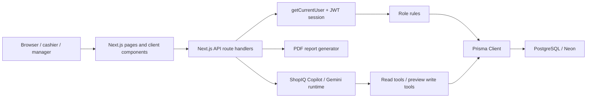
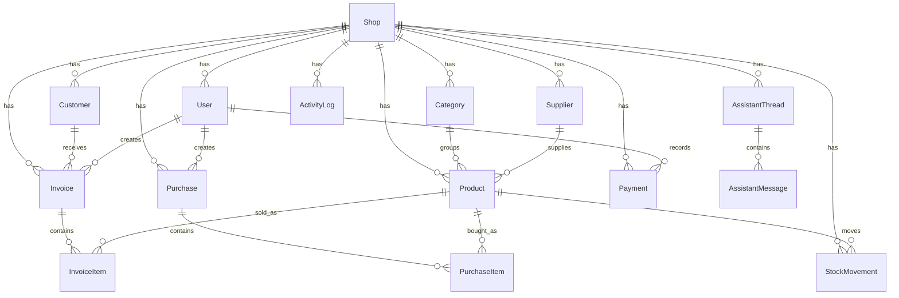
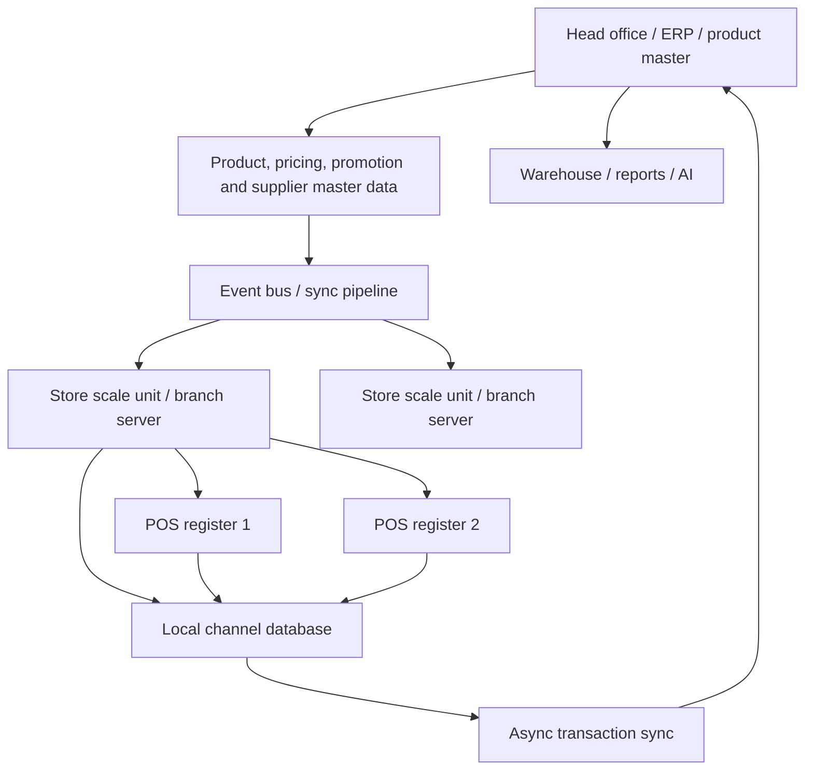
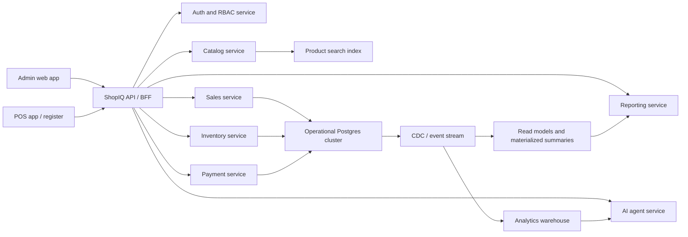
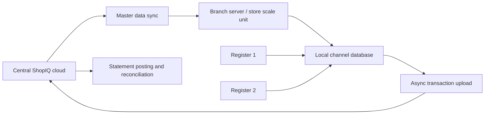

# ShopIQ Architecture and Enterprise Scaling README

This document explains the current ShopIQ architecture and how it can evolve from a single-shop or small-chain system into a large-scale supermarket-grade POS and inventory platform capable of handling millions of products, high checkout traffic, multiple stores, offline registers, analytics, and AI-assisted operations.

The goal is not to make ShopIQ complicated for no reason. The current app is well suited for small and medium stores. The scaling plan below shows what must change when the business grows from thousands of records to millions of products and years of sales history.

## 1. Current Architecture Summary

ShopIQ is currently a full-stack Next.js application using the App Router. It combines the public landing page, authenticated admin/staff workspaces, API route handlers, Prisma database access, PDF report generation, and Gemini-powered AI assistance inside one project.

### Current Technology Stack

| Layer | Current implementation |
| --- | --- |
| Frontend | Next.js 14 App Router, React 18, TypeScript |
| Styling | Tailwind CSS, custom global theme system, light/dark/classic/liquid glass/tweakcn theme support |
| UI components | Custom workspace components, Chart.js, React Chart.js, Recharts in some areas, lucide-react icons |
| Backend | Next.js Route Handlers under `src/app/api` |
| Database ORM | Prisma Client |
| Database | PostgreSQL, typically Neon via `DATABASE_URL` |
| Auth | Email/password with bcryptjs, JWT session cookie through `jose` |
| Authorization | Role based permissions in `src/lib/permissions.ts` |
| Validation | Zod validation helpers in `src/lib/validation.ts` |
| AI | Gemini via `@google/genai`, with queueing, key rotation, cooldown, caching, model routing, and tool execution |
| Reports | PDF generation using `pdf-lib` |
| Seeds | Prisma seed scripts for sample retail workspaces |

### Important Source Areas

| Area | Files |
| --- | --- |
| Global app shell | `src/components/workspace/app-shell.tsx`, `sidebar.tsx`, `topbar.tsx` |
| Auth/session | `src/lib/auth.ts`, `src/lib/session.ts`, `src/middleware.ts` |
| Permissions | `src/lib/permissions.ts` |
| Prisma client | `src/lib/prisma.ts` |
| Dashboard data | `src/lib/data.ts` |
| Table state | `src/lib/table-pagination.ts` |
| API routes | `src/app/api/**/route.ts` |
| AI system | `src/lib/ai/index.ts`, `src/lib/ai/shopiq-agent.ts`, `src/app/api/ai/chat/route.ts` |
| PDF reports | `src/lib/report-pdf.ts`, `src/app/api/reports/export/route.ts` |
| Workspace UI | `src/components/workspace/**` |

## 2. Current Runtime Flow



The app currently works as a tightly integrated web application. A user signs in, receives a secure cookie, enters the Admin or Staff workspace, and the server reads/writes data through Prisma. API routes protect every operation with the current user and role permissions before touching the database.

## 3. Current Database Architecture

The Prisma schema models a single logical shop workspace with users, products, customers, suppliers, invoices, purchases, payments, stock movements, assistant history, and activity logs.

### Current Core Models

| Model | Purpose |
| --- | --- |
| `Shop` | Tenant/workspace root. Owns all operational data. |
| `User` | Staff/admin/manager account with role, status, designation and optional staff details. |
| `Category` | Product category scoped per shop. |
| `Product` | Shop product/SKU with pricing, stock, supplier/category, location and expiry fields. |
| `Customer` | Customer account, dues, loyalty/card style fields and contact fields. |
| `Supplier` | Supplier profile, payment terms, reliability, balances and purchase links. |
| `Invoice` | Sales/billing header with totals, status, customer, cashier/channel fields. |
| `InvoiceItem` | Sales line items linked to products. |
| `Purchase` | Supplier purchase header with totals and status. |
| `PurchaseItem` | Purchase line items linked to products. |
| `Payment` | Customer incoming and supplier outgoing payments. |
| `StockMovement` | Stock ledger entries for opening, sale, purchase, return, adjustment and damage. |
| `AssistantThread` | Saved AI conversation thread. |
| `AssistantMessage` | Message history and AI action metadata. |
| `ActivityLog` | Human-readable system activity feed. |

### Current Database Strengths

- Most records are scoped with `shopId`, which supports multi-tenant isolation at the application layer.
- Important identifiers are unique per shop, such as `Product(shopId, sku)`, `Category(shopId, name)`, `Invoice(shopId, invoiceNo)`, and `Purchase(shopId, purchaseNo)`.
- Core foreign keys are modeled in Prisma with cascade, restrict or set-null behavior.
- Operational history exists through `StockMovement`, `Payment`, `ActivityLog`, and assistant messages.
- The schema already has indexes on frequent lookup fields such as `shopId`, `status`, `createdAt`, `invoiceDate`, `purchaseDate`, `customerId`, `supplierId`, `productId`, and balances.

### Current Database Shape



## 4. Current Business Logic

### Authentication and Sessions

Sessions are JWT-based. `src/lib/session.ts` signs a token containing:

- user id
- shop id
- role
- name
- email

The token is stored in an HTTP-only cookie. Production requires a strong `JWT_SECRET`.

### Role Based Permissions

`src/lib/permissions.ts` defines a simple, readable matrix:

| Resource | Admin | Manager | Staff |
| --- | --- | --- | --- |
| Products | full CRUD | full CRUD | read |
| Customers | full CRUD | full CRUD | create/read/update |
| Suppliers | full CRUD | full CRUD | no normal access |
| Payments | full CRUD | full CRUD | create/read customer payments |
| Invoices | full CRUD | full CRUD | create/read |
| Purchases | full CRUD | full CRUD | no normal access |
| Staff | full CRUD | can manage staff only | no management |
| Reports | read | read | no normal access |
| Settings | manage | manage | no normal access |
| Assistant | create/read | create/read | create/read |

### Billing Flow

Invoice creation currently:

1. validates request payload with Zod,
2. verifies user and role,
3. verifies customer if supplied,
4. loads selected products,
5. checks stock,
6. calculates subtotal, discount, tax, paid and due,
7. creates invoice and invoice items in a transaction,
8. decrements product stock,
9. creates stock movements,
10. increments customer balance if due remains,
11. writes an activity log.

This is good for a small or medium shop, but it needs stronger concurrency protection for high traffic POS registers. At enterprise scale, stock decrement should be conditional or locked so two registers cannot sell the same final unit at the same time.

### AI System

The AI system is already more advanced than a simple chat wrapper:

- Gemini provider integration.
- Request queue to control concurrency.
- Multiple configured provider keys with cooldown and failure tracking.
- Task classes for light, standard and heavy model routing.
- Cache for repeated AI responses.
- Tool-calling support.
- Confirmation-gated write actions.
- Thread history with saved assistant messages.
- API timeout handling and cleanup of incomplete failed turns.

This is a strong foundation. For enterprise scale, AI must move further into background jobs, summarized data marts and precomputed business context instead of querying live transactional tables for every answer.

## 5. Current Scaling Limits

The current architecture is practical for small stores and demos, but these areas will become bottlenecks at large retail scale.

### Data Loading Limits

Some current endpoints and data functions still load broad datasets:

- `src/app/api/products/route.ts` `GET` loads all products for a shop.
- `src/lib/data.ts` loads all active products and all customers for dashboard calculations.
- `src/app/api/invoices/route.ts` limits invoices to 150 but does not yet expose a full filtered/cursor API.
- AI business context is built from the dashboard snapshot, which will become expensive as data grows.

For millions of products, every list, dashboard and AI summary must use bounded queries, cursor pagination, aggregates, search indexes or materialized summaries.

### Stock Concurrency Limits

The invoice API checks stock before the transaction, then decrements stock inside the transaction. Under concurrent POS traffic, two checkouts can both see the same stock before either decrement is committed.

Enterprise POS should use one of these patterns:

- conditional update: decrement only where `stockQty >= requestedQty`,
- row locking: `SELECT ... FOR UPDATE` on product or inventory balance rows,
- stock reservation rows with expiry,
- append-only stock ledger plus materialized current balance,
- idempotency keys for every sale and payment request.

### Schema Limits

Current `Product` combines product master, store listing, price, stock, location, supplier, batch and media fields in one table. That is fine for a local shop, but not for millions of SKUs across branches.

Large retailers usually split:

- product master,
- product variants,
- barcodes/identifiers,
- store-specific listings,
- price books,
- promotions,
- tax rules,
- supplier catalog entries,
- inventory balances,
- inventory ledger,
- media/assets.

### Deployment Limits

Current ShopIQ is a single web app plus one central Postgres database. That is simple and good for development. Large supermarket POS systems use a hub-and-spoke model: a head office system, channel/store scale units, local channel databases, and sync services. Microsoft Dynamics 365 Commerce describes this pattern as headquarters plus distributed Commerce Scale Units that can be cloud-hosted or self-hosted near stores. Its in-store topology includes register apps, channel databases and async sync services.

## 6. What Large Supermarket POS Systems Usually Do

Large retail systems are designed around the fact that checkout cannot stop just because internet connectivity is weak.

### Common Enterprise Retail Architecture



### Common Characteristics

- Head office owns product master, pricing, promotions, employees, tax rules and reporting.
- Store scale units keep the store running even when the central system is slow or unreachable.
- POS registers can work offline against a local channel database.
- Transactions sync back asynchronously.
- Master data syncs from headquarters to stores.
- Reporting and AI are served from read models, marts or warehouses rather than the checkout database.
- Product search is usually backed by a specialized search engine or indexed product service.
- Inventory is modeled as a ledger plus balances, not only a mutable stock number.

## 7. Target Architecture for Millions of Products

ShopIQ should evolve into a modular retail platform with clear boundaries.



This does not mean immediately splitting into microservices. A safer path is a modular monolith first, then extract services only when load or team size requires it.

## 8. Database Redesign for Enterprise Scale

### 8.1 Split Product Master from Store Inventory

Current:

```text
Product = product identity + price + stock + supplier + location + image + batch
```

Target:

```text
ProductMaster
ProductVariant
ProductIdentifier
ProductMedia
StoreProductListing
PriceBook
PriceBookItem
Promotion
TaxCategory
SupplierProduct
InventoryLocation
InventoryBalance
InventoryLedger
StockReservation
```

This allows one product to exist globally while each store has its own price, availability, shelf, stock and reorder rules.

### 8.2 Use an Inventory Ledger

Current:

- `Product.stockQty` stores current stock.
- `StockMovement` stores movement history.

Target:

- `InventoryLedger` is the source of truth.
- `InventoryBalance` is a fast current balance table.
- Every stock-affecting action writes a ledger row and updates the matching balance row in the same transaction.

Example target shape:

```sql
InventoryBalance(
  shopId,
  storeId,
  productId,
  locationId,
  onHandQty,
  reservedQty,
  availableQty,
  version,
  updatedAt
)

InventoryLedger(
  id,
  shopId,
  storeId,
  productId,
  locationId,
  movementType,
  quantity,
  beforeQty,
  afterQty,
  referenceType,
  referenceId,
  idempotencyKey,
  createdAt
)
```

### 8.3 Partition the Largest Tables

PostgreSQL declarative partitioning is designed for very large tables where common queries can avoid scanning irrelevant partitions. PostgreSQL docs explain that partitioning splits one logical table into smaller physical pieces and can improve query performance when queries hit only a subset of partitions.

Recommended future partitions:

| Table | Partition strategy |
| --- | --- |
| `Invoice` | range by `invoiceDate`, optionally subpartition by `shopId` or `storeId` |
| `InvoiceItem` | partition by invoice month or parent invoice id strategy |
| `Payment` | range by `paidAt` |
| `StockMovement` / `InventoryLedger` | range by `movedAt` / `createdAt`, subpartition by store |
| `ActivityLog` | range by `createdAt` with retention/archive |
| `AssistantMessage` | range by `createdAt` if history becomes large |
| `ProductIdentifier` | hash by normalized barcode/sku if billions of identifiers |

Partitioning is not free. It should be introduced when table size and query patterns justify it. The partition key must match common `WHERE` clauses.

### 8.4 Add Read Models and Materialized Views

Dashboards should not calculate everything by scanning transactional tables.

Use summary tables or materialized views for:

- daily sales by store,
- category revenue,
- payment method totals,
- product velocity,
- low-stock counts,
- customer due summaries,
- supplier payable summaries,
- stock valuation by category/location,
- cashier performance.

PostgreSQL materialized views store query results and can be indexed, making repeated dashboard/report reads faster. They must be refreshed on a schedule or replaced with incrementally maintained summary tables for near real-time views.

### 8.5 Use Search Infrastructure

For millions of products, `contains` queries on product names will not be enough.

Recommended path:

1. Add PostgreSQL full-text/trigram indexes for medium scale.
2. Normalize product names, SKU, barcode and brand into a search document.
3. Add OpenSearch, Elasticsearch, Typesense or Meilisearch when catalog search becomes central.
4. Keep search eventually consistent through event streaming or background sync.

### 8.6 Replace Offset Pagination at Deep Scale

Offset pagination becomes slow for deep pages. Use cursor/keyset pagination for large tables:

```text
GET /api/products?cursor=lastSeenId&pageSize=50
GET /api/invoices?beforeDate=2026-05-21T10:00:00Z&pageSize=50
```

Keep offset pagination only for small admin lists where users rarely go deep.

## 9. API and Application Layer Improvements

### Current Pattern

Route handlers currently do:

```text
authenticate -> authorize -> validate -> query Prisma -> return JSON
```

This is good and readable. To scale, business logic should move into service modules so API routes stay thin.

### Target Pattern

```text
Route Handler
  -> Auth and RBAC
  -> Zod request schema
  -> Domain service
  -> Repository/query layer
  -> Transaction/outbox
  -> API response
```

Recommended modules:

```text
src/server/catalog/
src/server/inventory/
src/server/sales/
src/server/purchasing/
src/server/payments/
src/server/reports/
src/server/assistant/
src/server/audit/
```

Each module should own:

- validation schemas,
- service methods,
- Prisma queries,
- transaction boundaries,
- authorization checks where needed,
- events emitted to an outbox.

## 10. POS and Offline Store Architecture

Large supermarkets cannot depend on a single remote web server for checkout.

### Why Offline POS Matters

If internet is down:

- cashier must still scan products,
- prices/promotions must still work,
- receipt numbers must still be generated,
- payments may need offline/stand-in behavior depending on provider,
- transactions must sync later,
- managers need reconciliation tools.

### Target ShopIQ Offline Design



### Data Sent Down to Stores

- active products for that store,
- barcodes,
- price books,
- promotions,
- tax rules,
- staff permissions,
- customer lookup subset,
- stock on hand,
- registers/counters,
- receipt sequences.

### Data Sent Up from Stores

- sale headers,
- sale lines,
- payment records,
- returns,
- cash drawer events,
- stock adjustments,
- end-of-day statements,
- sync errors and conflicts.

## 11. Event-Driven Backbone

At enterprise scale, write operations should produce domain events.

Examples:

```text
ProductCreated
ProductPriceChanged
StockReceived
StockSold
InvoiceCreated
PaymentReceived
CustomerBalanceChanged
PurchaseReceived
LowStockDetected
ReportGenerated
AiActionApproved
```

Use an outbox table first:

```text
OutboxEvent(
  id,
  shopId,
  aggregateType,
  aggregateId,
  eventType,
  payload,
  status,
  attempts,
  createdAt,
  processedAt
)
```

Then a worker publishes events to queues/search/read models. This avoids losing events when the database write succeeds but a queue publish fails.

## 12. Reporting and Analytics at Scale

Current PDF reports are generated directly from app snapshots and database queries. This is fine for small and medium data.

At millions of rows:

- reports should run from summary/read tables,
- long reports should be background jobs,
- generated PDFs should be stored in object storage,
- ActivityLog should link to the stored report,
- heavy analytics should use a warehouse or columnar store,
- dashboards should read compact aggregates, not raw invoices.

Recommended reporting layers:

| Layer | Purpose |
| --- | --- |
| OLTP Postgres | live transactions and current operational state |
| Summary tables | fast dashboard cards and normal reports |
| Materialized views | nightly or periodic analytical summaries |
| Warehouse/lake | historical analysis, forecasting, AI context |
| Object storage | generated PDF/Excel exports |

## 13. AI at Scale

The current AI runtime already has queueing, model routing and caching. The next level is data reduction and job orchestration.

### Current AI Strengths

- queue-controlled Gemini requests,
- key failure/cooldown tracking,
- cache support,
- task model classes,
- tool calling,
- write action confirmation,
- saved threads,
- timeout cleanup.

### Future AI Improvements

| Improvement | Why it matters |
| --- | --- |
| AI job table | Durable jobs survive server restart and can be retried. |
| AI action audit table | Every proposed, approved, rejected and executed action is traceable. |
| Summary-first context | AI receives compact business facts, not raw tables. |
| Embeddings/search index | AI can find products, customers and records without scanning everything. |
| Report generation worker | Heavy PDF reports do not block chat requests. |
| Permission-aware tool registry | Staff AI tools are automatically restricted by role. |
| Rate budget per shop/user | Prevents one user or store from exhausting AI quota. |

## 14. Deployment Architecture Roadmap

### Current

```text
Next.js app + Prisma + central Postgres
```

### Stage 1: Production Small Business

- Vercel or Node hosting for Next.js.
- Neon pooled connection string.
- Strong JWT secret.
- Server-side pagination everywhere.
- Daily backups.
- Error monitoring.
- Basic rate limits.
- Background jobs for reports and AI.

### Stage 2: Multi-Store Retail Chain

- Add `Organization`, `Store`, `Register`, `InventoryLocation`.
- Add store-specific inventory and price books.
- Add read replicas for reports.
- Add Redis for hot cache and rate limits.
- Add queue worker for reports, AI and sync.
- Add object storage for PDFs/images.
- Add outbox events.

### Stage 3: Supermarket / Hypermarket Scale

- Store scale units or branch servers.
- Local channel database per store.
- Offline POS support.
- Event streaming with Kafka/Redpanda/Pub/Sub.
- Product search service.
- Partitioned sales, payment and stock ledger tables.
- Analytics warehouse.
- Dedicated report service.
- Dedicated AI service with precomputed context.
- Data retention/archive policies.
- Observability: traces, metrics, logs, DB query plans.

## 15. Concrete Refactor Checklist

### Phase A - Fix Current Scale Bottlenecks

- Replace all broad `findMany` list endpoints with paginated APIs.
- Add search/filter/sort query params to products, customers, invoices, suppliers, payments and purchases.
- Use `select` instead of wide `include` when tables render only a few fields.
- Update dashboard to use aggregate queries and summary queries instead of loading all active products/customers.
- Add `@@index([shopId, barcode])` and consider `@@unique([shopId, barcode])` where barcode should be unique.
- Add conditional stock decrement to prevent overselling.
- Add idempotency key support for invoices, payments, purchases and AI write actions.
- Move invoice/purchase/payment logic into domain services.

### Phase B - Retail Data Model Upgrade

- Add `Store` and `Register`.
- Add `InventoryLocation`.
- Split product master from store listing.
- Add `InventoryBalance`.
- Rename or evolve `StockMovement` into `InventoryLedger`.
- Add `PriceBook`, `Promotion`, `TaxCategory`.
- Add `ReceiptSequence` per store/register/day.
- Add `OutboxEvent`.

### Phase C - Enterprise Query and Storage

- Add cursor pagination for deep product and transaction lists.
- Add full-text/trigram search for products/customers/suppliers.
- Partition `Invoice`, `Payment`, `InventoryLedger`, `ActivityLog`.
- Add summary tables for dashboard and reports.
- Add read replica for reporting.
- Add background workers.
- Add object storage for generated reports.

### Phase D - Offline POS

- Create a register app or PWA mode for checkout.
- Add local store database.
- Sync product/price/staff data down to the store.
- Sync transactions up to central ShopIQ.
- Add conflict resolution and reconciliation screen.
- Add store close/day close workflow.

## 16. Example Future Schema Additions

```prisma
model Store {
  id        String   @id @default(cuid())
  shopId    String
  name      String
  code      String
  city      String?
  address   String?
  createdAt DateTime @default(now())
  updatedAt DateTime @updatedAt

  @@unique([shopId, code])
  @@index([shopId, name])
}

model Register {
  id        String   @id @default(cuid())
  shopId    String
  storeId   String
  code      String
  status    String   @default("ACTIVE")
  createdAt DateTime @default(now())

  @@unique([storeId, code])
}

model InventoryBalance {
  id            String   @id @default(cuid())
  shopId        String
  storeId       String
  productId     String
  locationId    String?
  onHandQty     Int      @default(0)
  reservedQty   Int      @default(0)
  availableQty  Int      @default(0)
  version       Int      @default(1)
  updatedAt     DateTime @updatedAt

  @@unique([storeId, productId, locationId])
  @@index([shopId, productId])
  @@index([storeId, availableQty])
}

model OutboxEvent {
  id            String   @id @default(cuid())
  shopId        String
  aggregateType String
  aggregateId   String
  eventType     String
  payload       Json
  status        String   @default("PENDING")
  attempts      Int      @default(0)
  createdAt     DateTime @default(now())
  processedAt   DateTime?

  @@index([status, createdAt])
  @@index([shopId, aggregateType, aggregateId])
}
```

## 17. Example Safer Stock Update

Instead of checking stock and then decrementing later, use a conditional update pattern:

```ts
const updated = await tx.product.updateMany({
  where: {
    id: productId,
    shopId,
    stockQty: { gte: quantity }
  },
  data: {
    stockQty: { decrement: quantity }
  }
});

if (updated.count !== 1) {
  throw new Error("Not enough stock available.");
}
```

For enterprise inventory, this should eventually move to `InventoryBalance` with `storeId`, `locationId`, `reservedQty`, `availableQty`, and `version`.

## 18. What Not To Do

- Do not load all products into the browser for pagination.
- Do not run dashboard totals by scanning millions of rows on every page load.
- Do not let every AI request query raw operational tables.
- Do not treat `Product.stockQty` as the only source of truth at supermarket scale.
- Do not rely on one central web app for every checkout if stores need offline reliability.
- Do not use offset pagination for deep pages in very large tables.
- Do not mix product master, store stock, pricing, promotions and media in one table forever.

## 19. Recommended Enterprise End State

The strongest future ShopIQ architecture is:

```text
Modular Next.js admin workspace
+ dedicated POS/register app
+ central Postgres OLTP cluster
+ local store channel databases
+ product/search service
+ inventory ledger and balance model
+ event outbox and queue workers
+ read replicas and summary tables
+ analytics warehouse
+ AI service reading summarized business context
+ object storage for reports/images
+ observability and audit trails
```

This keeps the current simplicity for small shops while giving a clear path toward serious supermarket operations.

## 20. Reference Inspiration

These references were used to align the roadmap with proven retail and database patterns:

- Microsoft Dynamics 365 Commerce architecture describes Store Commerce apps, head-office capabilities, Commerce Scale Units, and hub/spoke retail deployment: https://learn.microsoft.com/en-au/dynamics365/commerce/dev-itpro/commerce-architecture
- Microsoft in-store topology documentation describes register apps, channel databases, self-hosted scale units, and async synchronization services: https://learn.microsoft.com/de-de/dynamics365/commerce/dev-itpro/retail-in-store-topology
- Oracle Retail Xstore documentation library shows enterprise POS documentation areas such as POS, mobile POS, shipping, receiving, inventory, reports, implementation, services and database dictionary: https://docs.oracle.com/cd/E62106_01/xpos/doclist.html
- SAP S/4HANA Cloud Retail omnichannel inventory and order response emphasizes real-time stock visibility across channels and fulfillment: https://help.sap.com/docs/SAP_S4HANA_CLOUD/64609d0ecac54654b0837cba34555b82/de7fa15755acac6be10000000a4450e5.html
- PostgreSQL declarative partitioning documentation explains partitioned tables, partition pruning and partition maintenance for large tables: https://www.postgresql.org/docs/current/ddl-partitioning.html
- PostgreSQL materialized view documentation explains persisted query results and indexed materialized views for faster reporting/dashboard reads: https://www.postgresql.org/docs/17/rules-materializedviews.html
- Neon Postgres docs are relevant for connection pooling, read replicas, branching, autoscaling and serverless Postgres operations: https://neon.com/docs

