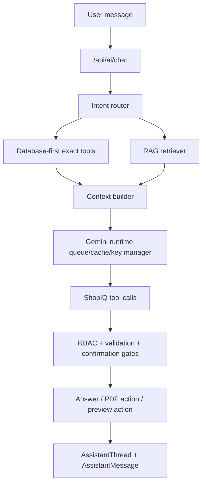
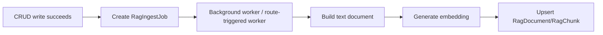
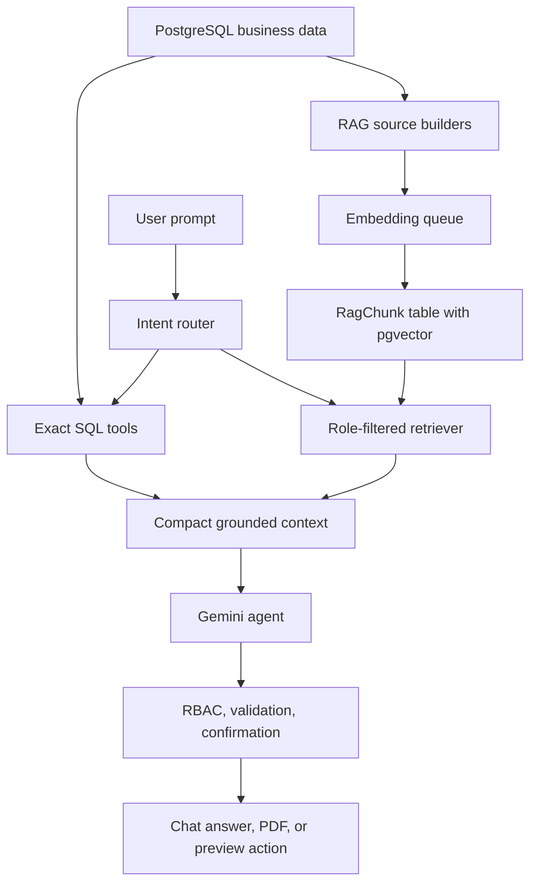
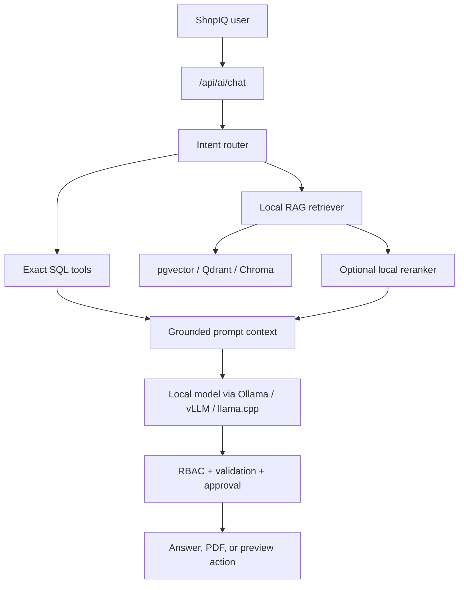
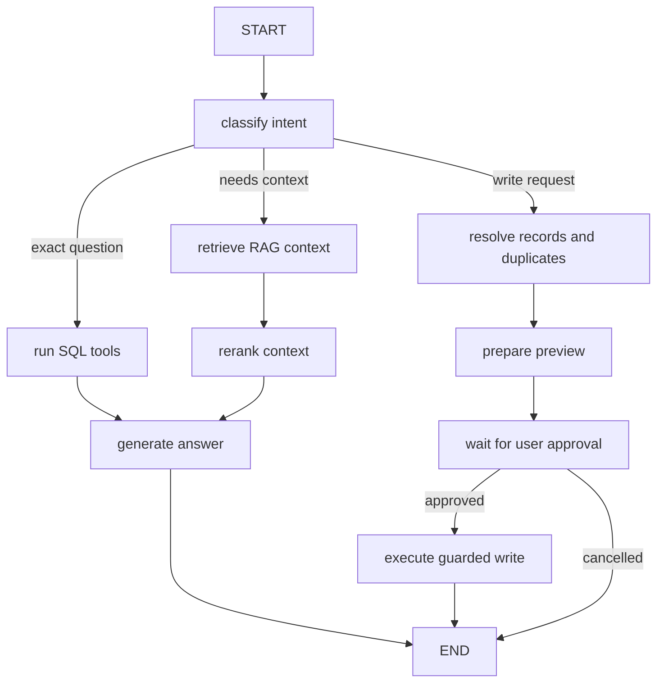

# ShopIQ RAG Migration Guide

This guide explains how to move ShopIQ's AI system from a mostly tool-calling Gemini agent into a proper retrieval-augmented generation system. The goal is not to replace the current database tools. The goal is to make the assistant better grounded, better at fuzzy search, better at reports, and better at answering app/business questions without sending huge raw tables to Gemini.

ShopIQ should use a hybrid AI architecture:

- SQL first for exact numbers, balances, stock, invoices, payments, and permissions.
- RAG for semantic search, summaries, app knowledge, product/customer/supplier context, report explanation, and long-term assistant memory.
- Gemini only after the server has selected the smallest useful context.
- Confirmation gates for every write action exactly like the current system already does.

## Why RAG

RAG means Retrieval Augmented Generation. The assistant does not depend only on the model's training data. Instead, the server retrieves relevant ShopIQ context first, then sends only that selected context to Gemini.

In ShopIQ this is useful for:

- Finding products when the user describes them loosely.
- Finding customers, suppliers, invoices, and purchases without exact IDs.
- Giving AI reports more business context without loading every table.
- Letting the assistant understand ShopIQ docs, policies, schema, role rules, and workflows.
- Reducing Gemini token usage and API cost.
- Improving answers when there are many products, invoices, and customers.

RAG should not be used for final accounting calculations. Exact totals should still come from PostgreSQL queries.

## Current AI Architecture

Current important files:

| Area | Current file | Purpose |
|---|---|---|
| Gemini runtime | `src/lib/ai/index.ts` | Gemini queue, key handling, model routing, cache, tool turn execution |
| ShopIQ agent | `src/lib/ai/shopiq-agent.ts` | Business tools, prompt, database-first answers, report actions, write previews |
| Chat API | `src/app/api/ai/chat/route.ts` | Assistant thread CRUD, user messages, AI responses, pending action approval |
| Usage API | `src/app/api/ai/usage/route.ts` | Gemini usage status |
| Reports API | `src/app/api/reports/route.ts` | Report data endpoint |
| PDF export | `src/app/api/reports/export/route.ts` | Database-backed PDF report generation |
| PDF renderer | `src/lib/report-pdf.ts` | Beautiful PDF creation |
| Dashboard data | `src/lib/data.ts` | Business snapshot used by dashboard, reports, and agent context |

Current `shopiq-agent.ts` tools:

| Tool | Current behavior | RAG migration |
|---|---|---|
| `get_dashboard_snapshot` | Reads role-filtered metrics and charts | Keep SQL only |
| `search_business_records` | Searches products/customers/etc. with SQL `contains` filters | Upgrade to hybrid SQL + vector retrieval |
| `get_record_details` | Loads exact record by ID | Keep SQL only |
| `run_operating_job` | Reorder, collections, cashflow, stock audit | Keep SQL calculations, optionally add RAG explanations |
| `get_sales_summary` | Exact date/range sales query | Keep SQL only |
| `get_customer_balance_summary` | Exact customer dues/ledger query | Keep SQL only |
| `get_product_performance` | Exact invoice-item performance query | Keep SQL only |
| `get_customer_credit_risk` | Exact risk ranking logic | Keep SQL first, optional RAG explanation |
| `build_business_report` | Builds PDF-ready report from live data | Keep PDF/database core, add RAG for insights and narrative |
| `prepare_business_action` | Validates create/update/payment/invoice/purchase/staff actions without writing | Keep confirmation gate, use RAG to resolve fuzzy names before preview |

## Recommended Stack

Use this stack first because ShopIQ already uses Next.js, Prisma, Neon/PostgreSQL, and `@google/genai`.

| Layer | Recommended choice | Why |
|---|---|---|
| Vector database | PostgreSQL + `pgvector` on Neon | Same database provider, shop-scoped security, easy backups |
| ORM | Prisma + raw SQL for vector similarity | Prisma can model vector columns as unsupported, but vector search is best with raw SQL |
| Embeddings | Gemini `gemini-embedding-001` with 1536 dimensions | Works with current Gemini provider and can reduce vector size |
| LLM | Existing Gemini runtime | Keep current queue, cache, model routing, cooldowns |
| Chunking | `@langchain/textsplitters` or small custom splitters | Good for docs and long text; entity rows can use custom one-record chunks |
| Optional framework | LangChain JS retrievers | Helpful if you want standard retriever abstractions |
| Reports | Existing `pdf-lib` pipeline | Keep accurate PDF generation and add retrieved insights |

Do not start with Pinecone or another managed vector DB unless Neon vector search becomes too slow or the vector dataset grows beyond what your Postgres plan handles comfortably.

## Best Tutorial And Documentation Links

Start with these:

- [Vercel AI SDK RAG Agent Guide](https://ai-sdk.dev/docs/guides/rag-chatbot)
- [Gemini Embeddings Docs](https://ai.google.dev/gemini-api/docs/embeddings)
- [Gemini File Search Tool](https://ai.google.dev/gemini-api/docs/file-search)
- [LangChain JS Retrieval Docs](https://docs.langchain.com/oss/javascript/langchain/retrieval)
- [LangChain JS PGVectorStore Integration](https://docs.langchain.com/oss/javascript/integrations/vectorstores/pgvector)
- [LangChain Google Generative AI Embeddings](https://docs.langchain.com/oss/javascript/integrations/embeddings/google_generative_ai)
- [Neon pgvector Docs](https://neon.com/docs/extensions/pgvector)
- [pgvector GitHub](https://github.com/pgvector/pgvector)
- [Prisma PostgreSQL Extensions Docs](https://www.prisma.io/docs/orm/prisma-schema/postgresql-extensions)

The Vercel guide is useful for the RAG flow. The Gemini docs are useful for embeddings. The Neon and pgvector docs are useful for storing and searching vectors in your existing database.

## Important Design Decision

Do not make every AI answer use RAG.

Use this routing:

| User asks | Best path |
|---|---|
| "How much sales today?" | SQL only |
| "How much is pending from Ali?" | SQL exact lookup, maybe vector to resolve "Ali" if ambiguous |
| "Find the blue packet Surf product" | Hybrid SQL + vector search |
| "What should I reorder?" | SQL stock/velocity first, RAG for explanation |
| "Generate sales report PDF" | SQL/PDF first, RAG only for insights text |
| "How does ShopIQ billing work?" | RAG over app docs/help/schema |
| "Create customer Bright Star School..." | RAG only to check duplicates/context, then preview-gated write |
| "Update that customer from last chat" | Thread memory + RAG + exact SQL record confirmation |

## Target RAG Architecture



The retriever should never bypass role checks. Retrieval must always filter by `shopId`, source type, and user role visibility.

## What To Index

Create searchable chunks from these sources:

| Source | Index? | Notes |
|---|---:|---|
| Products | Yes | One chunk per product with SKU, barcode, category, brand, location, stock, price, supplier |
| Categories | Yes | Useful for category search and report context |
| Customers | Yes | Name, phone, area, notes, type, current balance, recent ledger summary |
| Suppliers | Admin/Manager only | Name, type, phone, terms, balance, products supplied |
| Invoices | Yes, summarized | Do not embed every raw line forever; embed invoice summary and item names |
| Purchases | Admin/Manager only | Supplier, purchase status, items summary, payable context |
| Payments | Usually no full chunks | Use SQL for exact payment questions; optionally index payment references |
| Stock movements | Summarized only | Useful for "why did stock change?" but keep compact |
| Activity logs | Yes, recent only | Good for "what happened recently?" |
| Reports | Yes | Index generated report summaries and recommendation text |
| Assistant messages | Optional | Use only if you want long-term memory; never index failed AI turns |
| Project docs/readmes | Yes | Useful for "how does this module work?" |
| Permission rules | Yes | Helps AI explain roles, but enforcement remains in code |

Do not embed secrets, password hashes, JWTs, API keys, database URLs, or hidden internal-only debug output.

## Suggested Database Schema

Add these models to Prisma only after creating a real migration plan.

```prisma
model RagDocument {
  id          String   @id @default(cuid())
  shopId      String?
  sourceType  String
  sourceId    String?
  title       String
  contentHash String
  metadata    Json?
  createdAt   DateTime @default(now())
  updatedAt   DateTime @updatedAt

  chunks      RagChunk[]

  @@unique([shopId, sourceType, sourceId])
  @@index([shopId, sourceType])
  @@index([contentHash])
}

model RagChunk {
  id          String   @id @default(cuid())
  documentId  String
  document    RagDocument @relation(fields: [documentId], references: [id], onDelete: Cascade)
  shopId      String?
  sourceType  String
  sourceId    String?
  chunkIndex  Int
  title       String?
  content     String
  metadata    Json?
  contentHash String
  // Prisma cannot fully manage pgvector operations.
  // Use raw SQL migrations and raw SQL queries for this column.
  embedding   Unsupported("vector(1536)")?
  createdAt   DateTime @default(now())
  updatedAt   DateTime @updatedAt

  @@unique([documentId, chunkIndex])
  @@index([shopId, sourceType])
  @@index([sourceId])
  @@index([contentHash])
}

model RagIngestJob {
  id          String   @id @default(cuid())
  shopId      String?
  sourceType  String
  sourceId    String?
  status      String   @default("PENDING")
  error       String?
  createdAt   DateTime @default(now())
  updatedAt   DateTime @updatedAt

  @@index([shopId, status])
  @@index([sourceType, sourceId])
}
```

SQL migration shape:

```sql
CREATE EXTENSION IF NOT EXISTS vector;

-- Prisma can create the normal columns, but vector indexes usually belong in SQL migrations.
CREATE INDEX IF NOT EXISTS rag_chunk_embedding_hnsw
ON "RagChunk"
USING hnsw ("embedding" vector_cosine_ops);

CREATE INDEX IF NOT EXISTS rag_chunk_shop_source_idx
ON "RagChunk" ("shopId", "sourceType", "sourceId");
```

If you use Gemini's default 3072-dimensional embeddings, HNSW index support can become more expensive. For ShopIQ, prefer 1536 or 768 dimensions unless quality testing proves you need 3072.

## Environment Variables

Add these after implementation:

```env
RAG_ENABLED=true
RAG_VECTOR_PROVIDER=pgvector
RAG_EMBEDDING_PROVIDER=gemini
RAG_EMBEDDING_MODEL=gemini-embedding-001
RAG_EMBEDDING_DIMENSIONS=1536
RAG_TOP_K=8
RAG_MIN_SCORE=0.68
RAG_MAX_CONTEXT_CHARS=9000
RAG_INDEX_ASSISTANT_MEMORY=false
RAG_REINDEX_SECRET=replace-with-long-random-secret
```

Keep Gemini API keys server-side only. Do not expose embedding keys to the browser.

## Files To Add

Recommended new files:

| File | Purpose |
|---|---|
| `src/lib/rag/types.ts` | Shared RAG source/chunk/result types |
| `src/lib/rag/embedding.ts` | Gemini embedding client and batching |
| `src/lib/rag/chunking.ts` | Entity and document chunk builders |
| `src/lib/rag/sources.ts` | Converts products/customers/etc. into text documents |
| `src/lib/rag/ingest.ts` | Upsert/delete/reindex chunks |
| `src/lib/rag/retrieve.ts` | Vector search with role/shop filters |
| `src/lib/rag/context.ts` | Builds compact context blocks for Gemini |
| `src/lib/rag/intent.ts` | Decides when RAG is useful |
| `src/app/api/ai/rag/reindex/route.ts` | Admin-only reindex endpoint |
| `prisma/rag-backfill.ts` | One-time/backfill script for existing records |

Optional:

| File | Purpose |
|---|---|
| `src/app/api/ai/rag/search/route.ts` | Internal/admin debug endpoint for retrieval testing |
| `src/lib/rag/eval.ts` | Test questions and expected retrieved records |
| `src/lib/rag/langchain.ts` | LangChain PGVectorStore wrapper if you choose LangChain |

## Embedding Implementation

Use the existing `@google/genai` package.

Pseudo-code:

```ts
import { GoogleGenAI } from "@google/genai";

const ai = new GoogleGenAI({ apiKey: process.env.GEMINI_API_KEY });

export async function embedDocument(text: string) {
  const response = await ai.models.embedContent({
    model: process.env.RAG_EMBEDDING_MODEL || "gemini-embedding-001",
    contents: `title: ShopIQ record | text: ${text}`,
    config: {
      outputDimensionality: Number(process.env.RAG_EMBEDDING_DIMENSIONS || 1536)
    }
  });

  return response.embeddings?.[0]?.values || [];
}

export async function embedQuery(query: string) {
  const response = await ai.models.embedContent({
    model: process.env.RAG_EMBEDDING_MODEL || "gemini-embedding-001",
    contents: `task: question answering | query: ${query}`,
    config: {
      outputDimensionality: Number(process.env.RAG_EMBEDDING_DIMENSIONS || 1536)
    }
  });

  return response.embeddings?.[0]?.values || [];
}
```

Use a separate embedding queue from the chat queue. Embedding can be bursty during reindexing and should not block live chat responses.

## Vector Search Query

Use raw SQL through Prisma for vector similarity:

```ts
const vector = `[${embedding.join(",")}]`;

const rows = await prisma.$queryRawUnsafe<Array<{
  id: string;
  content: string;
  metadata: unknown;
  score: number;
}>>(
  `
  SELECT
    id,
    content,
    metadata,
    1 - ("embedding" <=> $1::vector) AS score
  FROM "RagChunk"
  WHERE
    ("shopId" = $2 OR "shopId" IS NULL)
    AND "sourceType" = ANY($3)
  ORDER BY "embedding" <=> $1::vector
  LIMIT $4
  `,
  vector,
  shopId,
  allowedSourceTypes,
  topK
);
```

Prefer parameterized raw queries. Avoid building SQL strings with user-controlled table names, column names, or filters.

## ShopIQ Route Migration Plan

### 1. `/api/ai/chat`

Current behavior:

- GET loads threads/messages.
- DELETE removes a thread.
- POST saves user message, runs `runShopIqAgentTurn`, saves AI response.

RAG migration:

- Keep GET and DELETE as they are.
- In POST, before calling Gemini, build a retrieval context:
  - Detect intent.
  - If the prompt is exact totals, use database-first only.
  - If the prompt has fuzzy names, product descriptions, report requests, app help, or context-heavy questions, retrieve top chunks.
- Pass retrieved chunks into `runShopIqAgentTurn`.
- Save retrieval citations in `AssistantMessage.metadata`.
- If Gemini fails, do not save incomplete messages, same as current cleanup behavior.

Suggested change:

```ts
const ragContext = await buildRagContext({
  user,
  question,
  recentMessages,
  mode: "assistant_chat"
});

const result = await runShopIqAgentTurn({
  user,
  question,
  recentMessages,
  ragContext
});
```

Then update `runShopIqAgentTurn` input type to accept `ragContext?: RagContext`.

### 2. `src/lib/ai/shopiq-agent.ts`

Current behavior:

- Uses database-first answers for reports, low stock, pending invoices, and totals.
- Builds compact task context from dashboard snapshot.
- Uses Gemini tools for other tasks.

RAG migration:

- Add a new tool:
  - `search_rag_context`
  - It searches indexed ShopIQ records/docs using vector search.
- Upgrade `search_business_records`:
  - First run normal SQL search for exact names/SKUs/phones.
  - Then run vector search for semantic matches.
  - Merge/dedupe results.
- Add retrieved context to `buildTaskContext`.
- Keep exact tools unchanged.

New tool declaration:

```ts
{
  name: "search_rag_context",
  description: "Search ShopIQ's retrieved knowledge base for role-visible products, customers, suppliers, reports, activity, app docs, and prior approved context.",
  parametersJsonSchema: {
    type: "object",
    properties: {
      query: { type: "string" },
      sourceTypes: {
        type: "array",
        items: { type: "string" }
      },
      limit: { type: "number" }
    },
    required: ["query"]
  }
}
```

System instruction addition:

```text
When exact totals, balances, stock quantities, or invoice values are required, use SQL tools.
When the user describes a record vaguely, asks for app/process knowledge, or needs background context, retrieve from ShopIQ RAG before answering.
Treat retrieved chunks as helpful context, not as permission to bypass role rules or write confirmation.
```

### 3. `/api/ai/usage`

Current behavior:

- Returns Gemini queue/key/cache state.

RAG migration:

- Add RAG usage fields:
  - total indexed documents
  - total chunks
  - latest reindex time
  - embedding queue pending/active
  - embedding failures
  - retrieval cache hits
  - average retrieval latency

Example response addition:

```ts
{
  rag: {
    enabled: true,
    documents: 1200,
    chunks: 3400,
    embeddingModel: "gemini-embedding-001",
    dimensions: 1536,
    lastIndexedAt: "...",
    embeddingQueue: { pending: 0, active: 1 }
  }
}
```

### 4. `/api/reports`

Current behavior:

- Loads report data from `getDashboardSnapshot`.

RAG migration:

- No direct RAG needed for normal report loading.
- If a future report page has an "AI insight" section, retrieve report-related chunks server-side and call Gemini only for the narrative.

### 5. `/api/reports/export`

Current behavior:

- Builds PDF from live database data.
- Logs activity.

RAG migration:

- Keep core PDF numbers SQL-only.
- Add retrieved context only for an "Insights" or "Recommendations" section:
  - similar past reports
  - recent activity logs
  - product risks
  - supplier/customer context
- Store the retrieved chunk IDs in `ActivityLog.metadata`.

Do not let RAG invent report rows. Tables and totals must stay database-backed.

### 6. AI report feature in `build_business_report`

Current behavior:

- Generates PDF action from live data.

RAG migration:

- Retrieve supporting context based on report type.
- For sales reports: retrieve top product/category/customer snippets.
- For inventory reports: retrieve product/category/stock-risk snippets.
- For customer reports: retrieve customer ledger summaries and recent activity.
- For supplier reports: retrieve supplier/purchase/payable summaries for manager/admin only.
- Give Gemini only the retrieved summary plus SQL totals.

### 7. AI write actions

Current behavior:

- `prepare_business_action` validates and previews.
- Actual write happens only after confirmation.

RAG migration:

- Before preparing writes, use RAG to find possible duplicates or resolve fuzzy references.
- Example: "Create customer Ali from Dhoraji" should retrieve existing Ali-like customers.
- If duplicates exist, ask user to confirm whether this is a new customer.
- Never write directly from retrieval.

## Indexing Strategy By Entity

### Product chunk

One chunk per product:

```text
Product: Surf Excel 500g
SKU: ALM-KHI-0028
Barcode: 8981000000028
Category: Cleaning & Household
Brand: Surf Excel
Sale price: PKR 480
Cost price: PKR 430
Stock: 18 pcs
Reorder level: 6
Location: Cleaning Shelf
Supplier: FMCG Small Distributor
Notes: Fast moving detergent item.
```

Metadata:

```json
{
  "shopId": "...",
  "sourceType": "product",
  "sourceId": "...",
  "sku": "ALM-KHI-0028",
  "categoryId": "...",
  "roleVisibility": ["ADMIN", "MANAGER", "STAFF"],
  "updatedAt": "..."
}
```

### Customer chunk

```text
Customer: Ahmed Raza
Phone: 0300-0004001
Area: Gulshan-e-Iqbal Block 7
Type: small credit customer
Balance: PKR 2,450
Credit limit: PKR 8,000
Notes: Pays weekly, sends order on WhatsApp.
Recent ledger: 3 invoices, 2 payments in latest visible period.
```

### Invoice chunk

Use invoice summary, not full raw JSON:

```text
Invoice KIR-POS-2026-000041
Customer: Walk-in
Date: 2026-05-14
Status: PAID
Total: PKR 1,850
Paid: PKR 1,850
Items: Olpers Milk 1L x2, Fresh Bread Large x1, Eggs Dozen x1
Channel: counter/POS
```

### App documentation chunk

Index:

- `README.md`
- `final_DB_readme.md`
- `ARCHITECTURE_SCALING_README.md`
- this `RAG_MIGRATION_GUIDE.md`
- role/permission explanations
- module workflow docs

This lets the assistant explain ShopIQ itself.

## Incremental Ingestion Plan

Use both backfill and live updates.

### Backfill

Create `prisma/rag-backfill.ts`:

1. Load each shop.
2. Load products, categories, customers, suppliers, invoices, purchases, activity logs, reports.
3. Convert records to `RagDocument`.
4. Chunk.
5. Embed in small batches.
6. Upsert document/chunks.
7. Print counts and failures.

Script:

```json
"rag:backfill": "tsx prisma/rag-backfill.ts"
```

### Live updates

After every successful CRUD write:

- product create/update/archive -> upsert/delete product RAG document
- customer create/update -> upsert customer RAG document
- supplier create/update -> upsert supplier RAG document
- invoice create/update/payment -> upsert invoice and customer summaries
- purchase create/payment -> upsert purchase and supplier summaries
- report generated -> index report summary
- assistant message saved -> optionally index if long-term memory is enabled

For reliability, prefer a `RagIngestJob` row instead of embedding inline during the user request.



## Role And Security Rules

RAG must obey the same rules as the UI and existing AI tools.

| Rule | Required behavior |
|---|---|
| Shop isolation | Every business chunk must have `shopId` and retrieval must filter by current user's shop |
| Staff restrictions | Staff should not retrieve supplier/payable/purchase chunks if staff cannot see those modules |
| Secrets | Never index env values, password hashes, session/JWT internals, API keys |
| Failed AI turns | Do not index failed user messages or failed AI responses |
| Write actions | Retrieval can help find context, but writes still require preview and confirmation |
| Deletes | Keep AI delete actions blocked unless you explicitly build confirmation + permissions |
| Auditability | Store retrieved chunk IDs in assistant message metadata for debugging |

## RAG Context Format

Keep context small and cited.

```text
Retrieved ShopIQ context:

[product:ALM-KHI-0028 score=0.86]
Surf Excel 500g, Cleaning & Household, stock 18, reorder level 6, sale PKR 480.

[customer:cust_123 score=0.82]
Ahmed Raza, Gulshan Block 7, balance PKR 2,450, pays weekly.

Rules:
- Use SQL tools for exact totals.
- Use retrieved chunks only as supporting context.
```

Also pass machine-readable source metadata:

```json
[
  {
    "chunkId": "ck...",
    "sourceType": "product",
    "sourceId": "prod...",
    "score": 0.86
  }
]
```

Save that metadata on the assistant response.

## Retrieval Modes

Create a small mode router:

| Mode | Trigger | Retrieval sources |
|---|---|---|
| `business_entity_search` | find/search/which item/customer/supplier | products, customers, suppliers, invoices |
| `report_context` | report/pdf/summary/insight | reports, activity logs, products, customers, suppliers by role |
| `app_help` | how do I/use/settings/role/schema | docs, permissions, readmes |
| `write_resolution` | create/update/payment/invoice/purchase | products, customers, suppliers, staff for duplicate/reference checks |
| `memory` | "like last time", "previous chat" | assistant messages if enabled |

## Hybrid Search

For record search, combine:

1. SQL exact/contains search
2. Vector search
3. Dedupe by entity ID
4. Prefer exact SQL matches
5. Return top results with scores

Example:

```ts
const sqlMatches = await searchBusinessRecordsSql(user, query);
const vectorMatches = await retrieveBusinessRecords(user, query);
return mergeMatches(sqlMatches, vectorMatches);
```

This is better than vector-only because SKUs, phone numbers, barcodes, and invoice numbers are exact identifiers.

## Chunking Rules

Use different chunking strategies by source:

| Source | Chunk strategy |
|---|---|
| Product/customer/supplier | One record = one chunk |
| Invoice/purchase | One summary chunk per record; maybe separate chunks for very large item lists |
| Activity logs | Batch 5-10 related logs per chunk or one log if important |
| Reports | Split by report section |
| Docs/readmes | Recursive text splitter, 800-1200 chars, 120-200 overlap |
| Assistant memory | One chunk per finalized useful conversation summary, not every message |

Do not blindly chunk database rows into tiny fragments. For business entities, a compact record summary works better.

## Caching

Add retrieval cache in memory first:

Cache key:

```text
shop:{shopId}:role:{role}:mode:{mode}:q:{normalizedQuery}:sources:{sourceTypes}
```

Cache TTL:

- 2 to 5 minutes for product/customer searches
- 30 to 60 seconds for stock-sensitive retrieval
- 15 to 30 minutes for app docs

Invalidate or bypass cache after relevant writes.

## Testing Plan

Create a simple RAG eval list:

| Query | Expected retrieval |
|---|---|
| "Find the detergent packet around 500 grams" | Surf Excel 500g / Bonus Detergent |
| "Who owes money in Gulshan?" | Customers with area Gulshan and balance > 0 |
| "Make a report about stock risk" | Low-stock product chunks + inventory report docs |
| "How does billing work?" | Billing workflow docs |
| "Create invoice for milk and bread" | Product chunks for milk and bread before preview |

Track:

- Did it retrieve the correct entity?
- Did it avoid restricted supplier data for staff?
- Did SQL still produce exact totals?
- Did Gemini receive fewer tokens than before?
- Did write actions still require confirmation?

## Implementation Phases

### Phase 1: Foundation

- Add `pgvector`.
- Add `RagDocument`, `RagChunk`, `RagIngestJob`.
- Add Gemini embedding helper.
- Add manual backfill script.
- Add retrieval helper using raw SQL.

### Phase 2: Chat grounding

- Add `buildRagContext`.
- Pass RAG context into `runShopIqAgentTurn`.
- Add `search_rag_context` tool.
- Save citations in assistant message metadata.
- Keep database-first exact answers unchanged.

### Phase 3: Hybrid business search

- Upgrade `search_business_records`.
- Add duplicate detection before AI record creation.
- Use RAG for fuzzy references in invoices, purchases, and payments.

### Phase 4: Reports

- Retrieve report-specific context.
- Add AI insight/recommendation section to PDF generation.
- Store retrieved context metadata in `ActivityLog`.

### Phase 5: Continuous indexing

- Queue ingestion jobs after CRUD writes.
- Add retry/cooldown for embedding failures.
- Add RAG usage stats to `/api/ai/usage`.

### Phase 6: Production polish

- Add retrieval evaluation tests.
- Add role leak tests.
- Add admin reindex button or CLI command.
- Add observability: retrieval latency, hit rate, top source types, embedding failures.

## Dependencies

Minimum:

```bash
npm install @langchain/textsplitters pg
```

Optional LangChain vector store:

```bash
npm install @langchain/community @langchain/core
```

You already have:

- `@google/genai`
- `@prisma/client`
- `zod`
- `next`
- `pdf-lib`

If you use Prisma raw SQL directly, you do not need LangChain PGVectorStore. If you want a standard retriever API, use LangChain.

## Gemini File Search Alternative

Gemini File Search is a managed RAG option from Google. It can be useful for static documents such as:

- ShopIQ help docs
- Policy docs
- Training docs
- PDF manuals

For ShopIQ business records, PostgreSQL + pgvector is still the better first choice because:

- You need strict `shopId` and role filtering.
- You need entity IDs for actions.
- You need reliable deletion/update when records change.
- You already have PostgreSQL and Prisma.

Use File Search later for uploaded manuals or user-provided business documents, not as the primary inventory/customer vector store.

## Common Mistakes To Avoid

- Do not send full database tables to Gemini.
- Do not use RAG for final money totals.
- Do not index secrets or failed AI requests.
- Do not let staff retrieve admin-only chunks.
- Do not rely on vector search for exact invoice numbers, SKUs, barcodes, or phone numbers.
- Do not embed inside slow user-facing writes unless the record is tiny and non-critical.
- Do not mix embedding models or dimensions in the same vector column.
- Do not create a separate vector collection per shop unless there is a strong operational reason.

## Final Recommended Architecture

ShopIQ should become:



The strongest version of ShopIQ AI is not "Gemini sees everything." It is "ShopIQ selects the right facts, Gemini explains and acts through guarded tools."

## Fully Custom RAG Model Path

This section explains the future version where ShopIQ does not depend mainly on Gemini for reasoning. Instead, ShopIQ runs its own local or private model, retrieves its own business context, and optionally fine-tunes an open-source model on ShopIQ-specific examples.

Important distinction:

- RAG is not the same as training a model.
- RAG gives the model fresh business facts at answer time.
- Fine-tuning teaches the model style, tool-use behavior, formatting, and ShopIQ workflows.
- Do not fine-tune fast-changing facts like stock quantities, invoice totals, balances, or product prices into the model. Those must stay in PostgreSQL and RAG.

The best enterprise path is:

1. Start with local/private RAG using an open-source model.
2. Add local embeddings and reranking.
3. Add LangGraph if the agent workflow becomes complex.
4. Fine-tune with LoRA only after you collect enough high-quality ShopIQ examples.
5. Keep SQL tools as the source of truth for exact business data.

## Fully Custom Architecture



This can still live behind the same `/api/ai/chat` route. The frontend does not need to know whether the backend used Gemini, Ollama, vLLM, or a fine-tuned model.

## Best Stack Options

### Option A: Ollama local RAG

Best for development, demos, privacy-first local use, and small deployments.

Use:

- Ollama for local chat models.
- Ollama or SentenceTransformers for embeddings.
- PostgreSQL + pgvector for vectors.
- Existing ShopIQ TypeScript agent code.

Good models to test:

| Purpose | Model examples |
|---|---|
| General chat/tool reasoning | `qwen2.5:7b`, `qwen2.5:14b`, `llama3.1:8b`, `mistral-nemo` |
| Lightweight local answers | `llama3.2:3b`, `qwen2.5:3b` |
| Embeddings | `nomic-embed-text`, `mxbai-embed-large`, `bge-m3` if available |
| Coding/dev explanations | `qwen2.5-coder:7b` |

Why Ollama:

- Runs locally.
- Has an HTTP API.
- Has OpenAI-compatible endpoints.
- Works with LangChain via `@langchain/ollama`.
- Easy to swap models during testing.

Official docs:

- [Ollama API / OpenAI compatibility](https://docs.ollama.com/api/openai-compatibility)
- [LangChain ChatOllama integration](https://docs.langchain.com/oss/javascript/integrations/chat/ollama/)

### Option B: vLLM or Text Generation Inference

Best for production GPU servers, many users, and higher throughput.

Use this when:

- ShopIQ needs many concurrent AI requests.
- You have a dedicated GPU server.
- You want OpenAI-compatible serving with better batching.
- Ollama becomes too slow under load.

This option is better for a serious SaaS deployment than running Ollama on the Next.js server.

### Option C: LangGraph private agent service

Best when the agent needs durable workflows:

- Multi-step report generation.
- Human approval loops.
- Retryable jobs.
- Tool use with branching.
- Long-running analysis.
- Audit checkpoints.

LangGraph is useful when a simple route handler becomes too tangled. The current ShopIQ agent can stay in TypeScript for now, but the future high-control version should use a graph.

Official docs:

- [LangGraph JS overview](https://docs.langchain.com/oss/javascript/langgraph/overview)
- [LangGraph StateGraph API](https://langchain-ai.github.io/langgraphjs/reference/classes/langgraph.StateGraph.html)

## Recommended Custom Path For ShopIQ

Use this order:

| Stage | What to build | Why |
|---|---|---|
| 1 | Keep Gemini RAG as the stable version | Fastest reliable production path |
| 2 | Add provider abstraction | Lets ShopIQ switch between Gemini and local models |
| 3 | Add Ollama local model provider | First private/custom model path |
| 4 | Add local embeddings | Removes embedding dependency from Gemini |
| 5 | Add local reranker | Improves retrieval quality |
| 6 | Add LangGraph service | Better orchestration for complex tasks |
| 7 | Fine-tune an open-source model with LoRA | Teach ShopIQ style and tool discipline |
| 8 | Deploy vLLM/TGI GPU server | Production-scale custom inference |

Do not jump straight to fine-tuning. First build RAG, collect examples, evaluate failures, then fine-tune.

## Provider Abstraction In ShopIQ

Create a clean provider interface:

```ts
export type AiModelMessage = {
  role: "system" | "user" | "assistant" | "tool";
  content: string;
};

export type AiModelResult = {
  text: string;
  toolCalls?: Array<{
    id?: string;
    name: string;
    args: Record<string, unknown>;
  }>;
  model: string;
  provider: string;
};

export interface ShopIqAiProvider {
  generate(input: {
    messages: AiModelMessage[];
    tools?: unknown[];
    temperature?: number;
    maxTokens?: number;
  }): Promise<AiModelResult>;
}
```

Then implement:

| Provider file | Purpose |
|---|---|
| `src/lib/ai/providers/gemini-provider.ts` | Existing Gemini behavior |
| `src/lib/ai/providers/ollama-provider.ts` | Local Ollama model |
| `src/lib/ai/providers/openai-compatible-provider.ts` | vLLM/TGI/Ollama compatible API |
| `src/lib/ai/providers/provider-router.ts` | Select provider by env |

New environment variables:

```env
AI_PROVIDER=ollama

OLLAMA_BASE_URL=http://localhost:11434
OLLAMA_CHAT_MODEL=qwen2.5:7b
OLLAMA_EMBEDDING_MODEL=nomic-embed-text
OLLAMA_NUM_CTX=8192
OLLAMA_TEMPERATURE=0.2

LOCAL_RAG_ENABLED=true
LOCAL_RAG_RERANK_ENABLED=false
LOCAL_RAG_VECTOR_STORE=pgvector
```

For vLLM/TGI/OpenAI-compatible servers:

```env
AI_PROVIDER=openai_compatible
LOCAL_OPENAI_BASE_URL=http://localhost:8000/v1
LOCAL_OPENAI_API_KEY=local-dev-key
LOCAL_OPENAI_MODEL=Qwen2.5-14B-Instruct
```

## Ollama Provider Example

Simple direct HTTP version:

```ts
export async function callOllamaChat(messages: Array<{ role: string; content: string }>) {
  const response = await fetch(`${process.env.OLLAMA_BASE_URL || "http://localhost:11434"}/api/chat`, {
    method: "POST",
    headers: { "Content-Type": "application/json" },
    body: JSON.stringify({
      model: process.env.OLLAMA_CHAT_MODEL || "qwen2.5:7b",
      messages,
      stream: false,
      options: {
        temperature: Number(process.env.OLLAMA_TEMPERATURE || 0.2),
        num_ctx: Number(process.env.OLLAMA_NUM_CTX || 8192)
      }
    })
  });

  if (!response.ok) {
    throw new Error(`Ollama request failed: ${response.status}`);
  }

  const data = await response.json();
  return {
    text: data.message?.content || "",
    model: data.model || process.env.OLLAMA_CHAT_MODEL || "ollama",
    provider: "ollama"
  };
}
```

OpenAI-compatible version:

```ts
export async function callOpenAiCompatible(messages: Array<{ role: string; content: string }>) {
  const response = await fetch(`${process.env.LOCAL_OPENAI_BASE_URL}/chat/completions`, {
    method: "POST",
    headers: {
      "Content-Type": "application/json",
      Authorization: `Bearer ${process.env.LOCAL_OPENAI_API_KEY || "local"}`
    },
    body: JSON.stringify({
      model: process.env.LOCAL_OPENAI_MODEL,
      messages,
      temperature: 0.2
    })
  });

  if (!response.ok) throw new Error(`Local model request failed: ${response.status}`);
  const data = await response.json();
  return {
    text: data.choices?.[0]?.message?.content || "",
    model: data.model,
    provider: "openai_compatible"
  };
}
```

This makes Ollama, vLLM, and many other servers easier to plug in.

## Local Embeddings

To become fully custom, do not rely on Gemini embeddings. Use a local embedding model.

Good local embedding choices:

| Model | Why |
|---|---|
| `nomic-embed-text` | Easy with Ollama, good default local embedding model |
| `mxbai-embed-large` | Strong semantic search model in many local setups |
| `BAAI/bge-m3` | Strong multilingual and long-context retrieval option |
| `sentence-transformers/all-MiniLM-L6-v2` | Very small and fast, but less powerful |

Ollama embedding example:

```ts
export async function embedWithOllama(text: string) {
  const response = await fetch(`${process.env.OLLAMA_BASE_URL || "http://localhost:11434"}/api/embed`, {
    method: "POST",
    headers: { "Content-Type": "application/json" },
    body: JSON.stringify({
      model: process.env.OLLAMA_EMBEDDING_MODEL || "nomic-embed-text",
      input: text
    })
  });

  if (!response.ok) throw new Error(`Ollama embedding failed: ${response.status}`);
  const data = await response.json();
  return data.embeddings?.[0] || data.embedding || [];
}
```

Important:

- If you change embedding models, rebuild all vectors.
- Keep one embedding dimension per vector table.
- Store `embeddingModel` and `embeddingDimensions` in metadata or a `RagIndexVersion` table.

## Local Reranking

Vector search gives likely matches. A reranker sorts them more intelligently.

Use reranking when:

- product names are similar
- customer names repeat
- invoices have long item lists
- reports need high-quality context

Recommended local reranker models:

- `BAAI/bge-reranker-v2-m3`
- `cross-encoder/ms-marco-MiniLM-L-6-v2`

Architecture:

1. Retrieve top 30 chunks from pgvector.
2. Rerank top 30 with a cross-encoder.
3. Keep top 6 to 10 chunks.
4. Send only those chunks to the model.

This improves quality without sending more data to the LLM.

## LangChain Version

If you prefer LangChain instead of writing your own provider wrappers:

```bash
npm install @langchain/ollama @langchain/core @langchain/community @langchain/textsplitters
```

Example:

```ts
import { ChatOllama, OllamaEmbeddings } from "@langchain/ollama";

const llm = new ChatOllama({
  model: process.env.OLLAMA_CHAT_MODEL || "qwen2.5:7b",
  temperature: 0.2,
  maxRetries: 2
});

const embeddings = new OllamaEmbeddings({
  model: process.env.OLLAMA_EMBEDDING_MODEL || "nomic-embed-text",
  baseUrl: process.env.OLLAMA_BASE_URL || "http://localhost:11434"
});
```

LangChain is helpful for quick integration. For ShopIQ's guarded write actions, exact SQL tools, and PDF generation, keep your own business logic and use LangChain only around model/retriever orchestration.

## LangGraph Version

Use LangGraph when the AI flow becomes more than one simple turn.

Suggested graph:



State shape:

```ts
type ShopIqAgentState = {
  userId: string;
  shopId: string;
  role: "ADMIN" | "MANAGER" | "STAFF";
  question: string;
  intent?: string;
  sqlResults?: unknown[];
  retrievedChunks?: Array<{ id: string; sourceType: string; sourceId?: string; score: number; content: string }>;
  pendingAction?: unknown;
  answer?: string;
  action?: { label: string; href: string };
  errors: string[];
};
```

Why LangGraph helps:

- Clear branching.
- Safer human approval.
- Durable long-running report jobs.
- Better retries.
- Better streaming progress.
- Easier testing of each node.

Do not move to LangGraph just for a basic chat answer. Move when the workflow has many branches.

## Fine-Tuning A ShopIQ Model

Fine-tuning should teach behavior, not facts.

Good fine-tuning targets:

- How ShopIQ formats answers.
- When to call SQL tools.
- When to call RAG retrieval.
- When to ask clarifying questions.
- How to prepare write previews.
- How to refuse unsafe actions.
- How to explain inventory, billing, dues, supplier payables, and reports.

Bad fine-tuning targets:

- Current stock quantities.
- Customer balances.
- Product prices.
- Exact invoice totals.
- Today's sales.
- Secrets or internal credentials.

Use LoRA/QLoRA fine-tuning, not training from scratch.

Recommended base models to test:

| Model family | Why |
|---|---|
| Qwen 2.5 / Qwen 3 instruct | Strong tool use and reasoning for business workflows |
| Llama 3.1 / 3.2 instruct | Good general local model ecosystem |
| Mistral / Mixtral instruct | Good instruction following, depending on hardware |

Training stack:

- Python
- Hugging Face `transformers`
- Hugging Face `datasets`
- Hugging Face `trl`
- `peft` for LoRA
- `bitsandbytes` for 4-bit/8-bit training when supported

Official docs:

- [Hugging Face TRL SFTTrainer](https://huggingface.co/docs/trl/v0.12.2/en/sft_trainer)
- [PEFT LoRA guide](https://huggingface.co/docs/peft/main/en/package_reference/lora)

## Training Dataset Format

Create examples from successful ShopIQ AI turns, manually reviewed and sanitized.

Example JSONL:

```json
{"messages":[{"role":"system","content":"You are ShopIQ Copilot. Use SQL tools for exact numbers and RAG for context. Never write without approval."},{"role":"user","content":"How much is pending from Ahmed Raza?"},{"role":"assistant","content":"TOOL_CALL get_customer_balance_summary {\"customerName\":\"Ahmed Raza\"}"},{"role":"tool","content":"{\"customer\":{\"name\":\"Ahmed Raza\",\"currentPendingBalance\":2450},\"outstandingInvoices\":[...]} "},{"role":"assistant","content":"Ahmed Raza has PKR 2,450 pending. The largest unpaid invoice is KIR-CREDIT-2026-000014."}]}
```

Write-action example:

```json
{"messages":[{"role":"system","content":"Database writes require preview and confirmation."},{"role":"user","content":"Create customer Bright Star School phone 03001234567 credit limit 250000."},{"role":"assistant","content":"TOOL_CALL prepare_business_action {\"action\":\"create_customer\",\"payload\":{\"name\":\"Bright Star School\",\"phone\":\"03001234567\",\"creditLimit\":250000},\"reason\":\"The user asked to create a customer.\"}"},{"role":"tool","content":"{\"pendingAction\":\"create_customer\",\"previewMarkdown\":\"## Create Customer Preview...\"}"},{"role":"assistant","content":"I prepared the customer creation preview. Reply Yes, proceed to save it, or Cancel to discard it."}]}
```

Dataset rules:

- Remove real phone numbers if needed.
- Remove secrets.
- Remove failed AI turns.
- Keep role labels.
- Keep tool names exactly matching ShopIQ.
- Include refusal examples.
- Include "ask for missing fields" examples.
- Include examples where SQL is chosen instead of RAG.
- Include examples where RAG is chosen instead of SQL.

## Training Pipeline

```mermaid
flowchart LR
  Logs["Approved AI conversations + curated examples"] --> Sanitize["Sanitize PII/secrets"]
  Sanitize --> Dataset["JSONL instruction dataset"]
  Dataset --> Split["Train/eval split"]
  Split --> SFT["LoRA SFT training"]
  SFT --> Eval["Tool-use and role-leak eval"]
  Eval --> Merge["Optional merge adapter"]
  Merge --> Quantize["Quantize GGUF / AWQ / GPTQ"]
  Quantize --> Serve["Ollama / vLLM / TGI"]
  Serve --> ShopIQ["ShopIQ provider abstraction"]
```



Minimum training script shape:

```python
from datasets import load_dataset
from trl import SFTTrainer, SFTConfig

dataset = load_dataset("json", data_files={
    "train": "data/shopiq-sft-train.jsonl",
    "eval": "data/shopiq-sft-eval.jsonl",
})

config = SFTConfig(
    output_dir="./models/shopiq-copilot-lora",
    per_device_train_batch_size=1,
    gradient_accumulation_steps=8,
    learning_rate=2e-5,
    num_train_epochs=2,
    max_seq_length=4096,
)

trainer = SFTTrainer(
    model="Qwen/Qwen2.5-7B-Instruct",
    args=config,
    train_dataset=dataset["train"],
    eval_dataset=dataset["eval"],
)

trainer.train()
trainer.save_model()
```

Real training will need GPU setup and careful dependency versions. Start with a tiny dataset and prove the loop works before training a large model.

## Serving A Fine-Tuned Model

For local demo:

- Convert/quantize to GGUF if using llama.cpp/Ollama.
- Create an Ollama Modelfile.
- Run it locally.

Example Modelfile concept:

```text
FROM ./shopiq-copilot-qwen2.5-7b-q4.gguf

SYSTEM """
You are ShopIQ Copilot. Use SQL tools for exact values. Use RAG for context.
Never write to the database without preview and explicit user confirmation.
Respect role permissions.
"""

PARAMETER temperature 0.2
PARAMETER num_ctx 8192
```

Then:

```bash
ollama create shopiq-copilot -f Modelfile
ollama run shopiq-copilot
```

For production:

- Prefer vLLM or TGI on a GPU server.
- Keep Next.js on Vercel or your app server.
- Keep model serving private behind server-side routes.
- Never call the local model directly from the browser.

## Custom Model Evaluation

Before replacing Gemini, evaluate:

| Test | Pass condition |
|---|---|
| Exact totals | Model uses SQL tools and does not guess |
| Customer dues | Correct customer is resolved and exact balance is from SQL |
| Product fuzzy search | Correct products retrieved from RAG |
| Staff role leak | Staff cannot see supplier/payable chunks |
| Write action | Model prepares preview, never writes directly |
| Missing fields | Model asks for missing fields |
| PDF report | Model returns PDF action and concise summary |
| Hallucination | Model says it cannot find data when retrieval/SQL returns nothing |

Keep Gemini as fallback until the local model passes these tests.

## Production Deployment Shapes

### Local desktop / classroom demo

```text
Next.js app -> Ollama on localhost -> PostgreSQL/pgvector
```

Good for:

- demos
- privacy
- no cloud AI cost

Limitations:

- depends on the local machine
- can be slow
- not ideal for multiple users

### Private GPU server

```text
Next.js app -> private AI gateway -> vLLM/TGI/Ollama GPU server -> PostgreSQL/pgvector
```

Good for:

- production
- many users
- controlled cost
- private inference

### Hybrid provider

```text
Simple tasks -> local model
Heavy reasoning/report wording -> Gemini
Exact data -> SQL
Context -> RAG
```

This is the practical middle ground. ShopIQ can run cheaply most of the time and still use a stronger cloud model when needed.

## Recommended Final Custom Setup

For ShopIQ, the most realistic final version is:

- PostgreSQL + pgvector for role-filtered business retrieval.
- Exact Prisma/PostgreSQL tools for money, stock, invoices, payments, and permissions.
- Ollama for local development and demos.
- vLLM or TGI for serious production local/private inference.
- LangGraph only for multi-step workflows like report generation, write approvals, retries, and long-running jobs.
- LoRA fine-tuning only after enough high-quality ShopIQ examples exist.
- Gemini kept as optional fallback for heavy reasoning until the custom model is proven.

This gives ShopIQ the strongest balance: private AI where possible, accurate SQL where required, RAG for grounding, and cloud AI only when it actually adds value.


