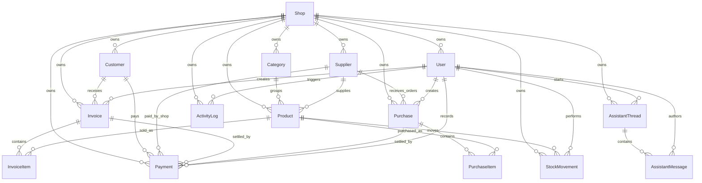
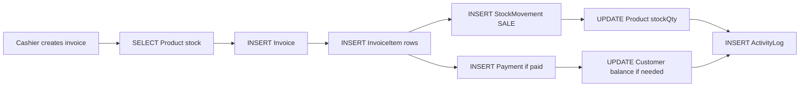

# ShopIQ Relational Database Schema

This document explains the final ShopIQ relational database design as defined in [`prisma/schema.prisma`](prisma/schema.prisma). The application uses Prisma ORM with PostgreSQL, and the schema is built for a multi-shop retail workspace with inventory, billing, purchasing, payments, stock ledgers, staff, activity logs, and AI assistant conversations.

## 1. Database Technology

- Database provider: PostgreSQL
- ORM: Prisma Client
- Schema file: `prisma/schema.prisma`
- Connection source: `DATABASE_URL`
- Primary key style: `String` IDs generated with `cuid()`
- Monetary precision: `Decimal` fields using PostgreSQL `DECIMAL(12,2)` for money and `DECIMAL(5,2)` for rates
- JSON storage: PostgreSQL `JSONB` through Prisma `Json`

## 2. High-Level Design

ShopIQ is a multi-tenant retail system. Almost every operational table has a `shopId` foreign key, so each shop owns its own users, products, customers, suppliers, invoices, purchases, payments, stock movements, assistant threads, and activity logs.

Core areas:

- `Shop`: tenant/store root
- `User`: staff accounts, roles, permissions, and ownership
- `Category` and `Product`: inventory catalog
- `Customer`: customer ledger and loyalty information
- `Supplier`: supplier ledger and procurement metadata
- `Invoice` and `InvoiceItem`: sales billing
- `Purchase` and `PurchaseItem`: supplier purchase intake
- `Payment`: money movement ledger
- `StockMovement`: inventory movement ledger
- `AssistantThread` and `AssistantMessage`: AI assistant conversation history
- `ActivityLog`: audit and operational timeline

## 3. Entity Relationship Overview



## 4. Enums

### `UserRole`

Controls high-level access in the app.

| Value | Meaning |
| --- | --- |
| `ADMIN` | Full shop owner/admin role |
| `MANAGER` | Operational manager role |
| `STAFF` | Regular staff role |

### `UserStatus`

| Value | Meaning |
| --- | --- |
| `ACTIVE` | User can use the system |
| `INVITED` | User was invited but not fully activated |
| `SUSPENDED` | User should not be allowed to operate |

### `ProductStatus`

| Value | Meaning |
| --- | --- |
| `ACTIVE` | Product is usable in inventory and billing |
| `ARCHIVED` | Product is hidden/retired but preserved historically |

### `InvoiceStatus`

| Value | Meaning |
| --- | --- |
| `DRAFT` | Invoice is being prepared |
| `PAID` | Total has been fully paid |
| `PARTIAL` | Some amount has been paid, some remains due |
| `UNPAID` | No payment has been received |
| `CANCELLED` | Invoice is voided |

### `PaymentDirection`

| Value | Meaning |
| --- | --- |
| `CUSTOMER_IN` | Money coming into the shop from a customer |
| `SUPPLIER_OUT` | Money going out from the shop to a supplier |

### `PaymentMethod`

Supported payment methods:

- `CASH`
- `BANK_TRANSFER`
- `CARD`
- `JAZZCASH`
- `EASYPAISA`
- `CHEQUE`
- `OTHER`

### `StockMovementType`

| Value | Meaning |
| --- | --- |
| `OPENING` | Initial stock entered into the system |
| `PURCHASE` | Stock increased from supplier purchase |
| `SALE` | Stock reduced by invoice sale |
| `RETURN_IN` | Stock returned into inventory |
| `RETURN_OUT` | Stock returned out to supplier or reversed from purchase |
| `ADJUSTMENT` | Manual count correction |
| `DAMAGE` | Stock removed due to damage/spoilage |

### `PurchaseStatus`

| Value | Meaning |
| --- | --- |
| `ORDERED` | Purchase order placed but not fully received |
| `RECEIVED` | Purchase stock has been received |
| `PARTIAL` | Some purchased stock has been received |
| `CANCELLED` | Purchase is voided |

## 5. Tables And Columns

## `Shop`

The root tenant table. Every store/business workspace starts here.

| Column | Type | Required | Default | Purpose |
| --- | --- | --- | --- | --- |
| `id` | `String` | Yes | `cuid()` | Primary key |
| `name` | `String` | Yes | - | Shop name |
| `city` | `String` | Yes | - | City of operation |
| `address` | `String?` | No | - | Shop address |
| `phone` | `String?` | No | - | Shop phone |
| `currency` | `String` | Yes | `PKR` | Currency code |
| `createdAt` | `DateTime` | Yes | `now()` | Creation timestamp |
| `updatedAt` | `DateTime` | Yes | `@updatedAt` | Auto-updated timestamp |

Constraints and indexes:

- Primary key: `id`
- Index: `createdAt`

Relations:

- One shop has many users, categories, products, customers, suppliers, invoices, purchases, payments, stock movements, assistant threads, and activity logs.
- Deleting a shop cascades to most shop-owned data.

## `User`

Stores staff/admin login accounts and operational role data.

| Column | Type | Required | Default | Purpose |
| --- | --- | --- | --- | --- |
| `id` | `String` | Yes | `cuid()` | Primary key |
| `shopId` | `String` | Yes | - | Owning shop |
| `name` | `String` | Yes | - | User name |
| `email` | `String` | Yes | - | Login email |
| `passwordHash` | `String` | Yes | - | Hashed password |
| `role` | `UserRole` | Yes | - | ADMIN, MANAGER, or STAFF |
| `status` | `UserStatus` | Yes | `ACTIVE` | Account status |
| `phone` | `String?` | No | - | Contact number |
| `designation` | `String?` | No | - | Job title |
| `cnic` | `String?` | No | - | Staff CNIC metadata |
| `shift` | `String?` | No | - | Work shift |
| `branchArea` | `String?` | No | - | Work area/counter/department |
| `joiningDate` | `DateTime?` | No | - | Staff joining date |
| `permissions` | `Json?` | No | - | Extra role/permission flags |
| `createdAt` | `DateTime` | Yes | `now()` | Creation timestamp |
| `updatedAt` | `DateTime` | Yes | `@updatedAt` | Auto-updated timestamp |

Constraints and indexes:

- Primary key: `id`
- Unique: `email` globally unique across all shops
- Index: `(shopId, role)`
- Index: `(shopId, status)`
- Index: `(shopId, branchArea)`

Foreign keys:

- `shopId -> Shop.id`
- Delete behavior: `Cascade`

Important delete behavior:

- Invoices, purchases, and payments reference the creating user with `Restrict`, so a user who created financial records cannot be deleted while those records exist.
- Stock movements, assistant messages, and activity logs use nullable user references in some places, so user deletion can preserve historical records by setting the user reference to `NULL`.

## `Category`

Groups products for browsing, reporting, and inventory structure.

| Column | Type | Required | Default | Purpose |
| --- | --- | --- | --- | --- |
| `id` | `String` | Yes | `cuid()` | Primary key |
| `shopId` | `String` | Yes | - | Owning shop |
| `name` | `String` | Yes | - | Category name |
| `color` | `String?` | No | - | UI color tag |
| `createdAt` | `DateTime` | Yes | `now()` | Creation timestamp |
| `updatedAt` | `DateTime` | Yes | `@updatedAt` | Auto-updated timestamp |

Constraints and indexes:

- Primary key: `id`
- Unique: `(shopId, name)`, so each shop can have one category with a given name
- Index: `(shopId, createdAt)`

Foreign keys:

- `shopId -> Shop.id`
- Delete behavior: `Cascade`

Product behavior:

- Products point to categories with `onDelete: SetNull`, so deleting a category keeps products but removes their category assignment.

## `Product`

The main inventory catalog table.

| Column | Type | Required | Default | Purpose |
| --- | --- | --- | --- | --- |
| `id` | `String` | Yes | `cuid()` | Primary key |
| `shopId` | `String` | Yes | - | Owning shop |
| `categoryId` | `String?` | No | - | Optional category |
| `supplierId` | `String?` | No | - | Optional default supplier |
| `sku` | `String` | Yes | - | Shop-specific SKU |
| `barcode` | `String?` | No | - | Barcode value |
| `name` | `String` | Yes | - | Product name |
| `brand` | `String?` | No | - | Brand/manufacturer |
| `description` | `String?` | No | - | Product details |
| `imageUrl` | `String?` | No | - | Product image URL |
| `unit` | `String` | Yes | `pcs` | Unit of measure |
| `costPrice` | `Decimal(12,2)` | Yes | - | Current cost |
| `salePrice` | `Decimal(12,2)` | Yes | - | Selling price |
| `taxRate` | `Decimal(5,2)` | Yes | `0` | Product-level tax rate |
| `discountRate` | `Decimal(5,2)` | Yes | `0` | Product-level discount rate |
| `stockQty` | `Int` | Yes | `0` | Current available stock |
| `reorderLevel` | `Int` | Yes | `5` | Low stock threshold |
| `reorderQuantity` | `Int` | Yes | `10` | Suggested reorder quantity |
| `location` | `String?` | No | - | Shelf/location label |
| `aisle` | `String?` | No | - | Aisle/zone label |
| `shelf` | `String?` | No | - | Shelf/bin label |
| `productType` | `String?` | No | - | Product classification |
| `isPerishable` | `Boolean` | Yes | `false` | Perishable flag |
| `batchNo` | `String?` | No | - | Batch number |
| `manufactureDate` | `DateTime?` | No | - | Manufacturing date |
| `expiryDate` | `DateTime?` | No | - | Expiry date |
| `status` | `ProductStatus` | Yes | `ACTIVE` | Active/archive status |
| `createdAt` | `DateTime` | Yes | `now()` | Creation timestamp |
| `updatedAt` | `DateTime` | Yes | `@updatedAt` | Auto-updated timestamp |

Constraints and indexes:

- Primary key: `id`
- Unique: `(shopId, sku)`, so SKU is unique per shop but can repeat across different shops
- Index: `(shopId, name)`
- Index: `(shopId, status)`
- Index: `(shopId, categoryId)`
- Index: `(shopId, supplierId)`
- Index: `(shopId, productType)`
- Index: `(shopId, expiryDate)`
- Index: `(shopId, stockQty, reorderLevel)`
- Index: `(shopId, createdAt)`

Foreign keys:

- `shopId -> Shop.id`, delete `Cascade`
- `categoryId -> Category.id`, delete `SetNull`
- `supplierId -> Supplier.id`, delete `SetNull`

Historical protection:

- Invoice items and purchase items reference products with `Restrict`, so products with sales/purchase history cannot be deleted through those relations.
- Stock movements reference products with `Cascade`, so if a product is deleted, its stock movements are deleted too. In normal business flow, products should usually be archived instead of deleted.

## `Customer`

Stores customer identity, loyalty metadata, credit limit, and running balance.

| Column | Type | Required | Default | Purpose |
| --- | --- | --- | --- | --- |
| `id` | `String` | Yes | `cuid()` | Primary key |
| `shopId` | `String` | Yes | - | Owning shop |
| `name` | `String` | Yes | - | Customer name |
| `phone` | `String?` | No | - | Phone number |
| `email` | `String?` | No | - | Email |
| `address` | `String?` | No | - | Address |
| `loyaltyCardNo` | `String?` | No | - | Loyalty card number |
| `customerType` | `String?` | No | - | Segment/type |
| `area` | `String?` | No | - | Local area |
| `city` | `String?` | No | - | City |
| `whatsapp` | `String?` | No | - | WhatsApp number |
| `loyaltyPoints` | `Int` | Yes | `0` | Loyalty balance |
| `lastVisitAt` | `DateTime?` | No | - | Last visit/order timestamp |
| `preferredPaymentMethod` | `PaymentMethod?` | No | - | Preferred payment method |
| `creditLimit` | `Decimal(12,2)` | Yes | `0` | Credit allowed |
| `balance` | `Decimal(12,2)` | Yes | `0` | Current amount due from customer |
| `notes` | `String?` | No | - | Notes |
| `createdAt` | `DateTime` | Yes | `now()` | Creation timestamp |
| `updatedAt` | `DateTime` | Yes | `@updatedAt` | Auto-updated timestamp |

Constraints and indexes:

- Primary key: `id`
- Index: `(shopId, name)`
- Index: `(shopId, phone)`
- Index: `(shopId, loyaltyCardNo)`
- Index: `(shopId, customerType)`
- Index: `(shopId, area)`
- Index: `(shopId, balance)`
- Index: `(shopId, createdAt)`

Foreign keys:

- `shopId -> Shop.id`, delete `Cascade`

Historical behavior:

- Invoices and payments reference customers with `SetNull`, so deleting a customer keeps historical invoice/payment records but removes the customer link.

## `Supplier`

Stores supplier contact, payment terms, tax metadata, and payables balance.

| Column | Type | Required | Default | Purpose |
| --- | --- | --- | --- | --- |
| `id` | `String` | Yes | `cuid()` | Primary key |
| `shopId` | `String` | Yes | - | Owning shop |
| `name` | `String` | Yes | - | Supplier name |
| `phone` | `String?` | No | - | Phone |
| `email` | `String?` | No | - | Email |
| `address` | `String?` | No | - | Address |
| `contactPerson` | `String?` | No | - | Contact person |
| `paymentTerms` | `String?` | No | - | Payment terms |
| `ntn` | `String?` | No | - | NTN metadata |
| `gstNumber` | `String?` | No | - | GST metadata |
| `leadTimeDays` | `Int?` | No | - | Expected delivery lead time |
| `supplierType` | `String?` | No | - | Supplier classification |
| `balance` | `Decimal(12,2)` | Yes | `0` | Payable amount owed to supplier |
| `reliabilityScore` | `Int` | Yes | `80` | Operational quality score |
| `notes` | `String?` | No | - | Notes |
| `createdAt` | `DateTime` | Yes | `now()` | Creation timestamp |
| `updatedAt` | `DateTime` | Yes | `@updatedAt` | Auto-updated timestamp |

Constraints and indexes:

- Primary key: `id`
- Index: `(shopId, name)`
- Index: `(shopId, phone)`
- Index: `(shopId, supplierType)`
- Index: `(shopId, balance)`
- Index: `(shopId, createdAt)`

Foreign keys:

- `shopId -> Shop.id`, delete `Cascade`

Historical behavior:

- Products, purchases, and payments reference suppliers with `SetNull`, so supplier deletion keeps historical operational records.

## `Invoice`

Represents a sales bill. It stores totals, due amount, channel, receipt metadata, and the staff member who created it.

| Column | Type | Required | Default | Purpose |
| --- | --- | --- | --- | --- |
| `id` | `String` | Yes | `cuid()` | Primary key |
| `shopId` | `String` | Yes | - | Owning shop |
| `customerId` | `String?` | No | - | Optional linked customer |
| `createdById` | `String` | Yes | - | User who created invoice |
| `invoiceNo` | `String` | Yes | - | Shop-specific invoice number |
| `status` | `InvoiceStatus` | Yes | `UNPAID` | Invoice status |
| `subtotal` | `Decimal(12,2)` | Yes | - | Sum before discount/tax |
| `discount` | `Decimal(12,2)` | Yes | `0` | Invoice discount |
| `tax` | `Decimal(12,2)` | Yes | `0` | Invoice tax |
| `total` | `Decimal(12,2)` | Yes | - | Final bill total |
| `paidAmount` | `Decimal(12,2)` | Yes | `0` | Amount received |
| `dueAmount` | `Decimal(12,2)` | Yes | `0` | Amount still due |
| `invoiceDate` | `DateTime` | Yes | `now()` | Invoice date |
| `dueDate` | `DateTime?` | No | - | Payment due date |
| `cashierCounter` | `String?` | No | - | Counter/register |
| `channel` | `String?` | No | - | POS, credit, delivery, etc. |
| `loyaltyDiscount` | `Decimal(12,2)` | Yes | `0` | Loyalty discount |
| `promoCode` | `String?` | No | - | Promo code |
| `receiptNo` | `String?` | No | - | Receipt number |
| `paymentBreakdown` | `Json?` | No | - | Split payment metadata |
| `notes` | `String?` | No | - | Notes |
| `createdAt` | `DateTime` | Yes | `now()` | Creation timestamp |
| `updatedAt` | `DateTime` | Yes | `@updatedAt` | Auto-updated timestamp |

Constraints and indexes:

- Primary key: `id`
- Unique: `(shopId, invoiceNo)`
- Index: `(shopId, channel)`
- Index: `(shopId, receiptNo)`
- Index: `(shopId, status)`
- Index: `(shopId, invoiceDate)`
- Index: `(shopId, customerId)`
- Index: `(shopId, createdAt)`

Foreign keys:

- `shopId -> Shop.id`, delete `Cascade`
- `customerId -> Customer.id`, delete `SetNull`
- `createdById -> User.id`, delete `Restrict`

Business calculation:

- `total = subtotal - discount - loyaltyDiscount + tax`
- `dueAmount = total - paidAmount`
- These are stored as columns for fast dashboards and reports.

## `InvoiceItem`

Line items for sales invoices.

| Column | Type | Required | Default | Purpose |
| --- | --- | --- | --- | --- |
| `id` | `String` | Yes | `cuid()` | Primary key |
| `invoiceId` | `String` | Yes | - | Parent invoice |
| `productId` | `String` | Yes | - | Sold product |
| `quantity` | `Int` | Yes | - | Quantity sold |
| `unitPrice` | `Decimal(12,2)` | Yes | - | Price at sale time |
| `costPrice` | `Decimal(12,2)` | Yes | - | Cost at sale time |
| `total` | `Decimal(12,2)` | Yes | - | Line total |
| `createdAt` | `DateTime` | Yes | `now()` | Creation timestamp |

Constraints and indexes:

- Primary key: `id`
- Index: `productId`
- Index: `invoiceId`

Foreign keys:

- `invoiceId -> Invoice.id`, delete `Cascade`
- `productId -> Product.id`, delete `Restrict`

Important:

- Invoice items do not have their own `shopId`; they inherit tenant context through `Invoice`.
- The database does not enforce that `InvoiceItem.productId` belongs to the same shop as the invoice. The application must validate this before creation.

## `Purchase`

Represents procurement from suppliers.

| Column | Type | Required | Default | Purpose |
| --- | --- | --- | --- | --- |
| `id` | `String` | Yes | `cuid()` | Primary key |
| `shopId` | `String` | Yes | - | Owning shop |
| `supplierId` | `String?` | No | - | Optional supplier |
| `createdById` | `String` | Yes | - | User who created purchase |
| `purchaseNo` | `String` | Yes | - | Shop-specific purchase number |
| `status` | `PurchaseStatus` | Yes | `RECEIVED` | Purchase status |
| `subtotal` | `Decimal(12,2)` | Yes | - | Purchase subtotal |
| `total` | `Decimal(12,2)` | Yes | - | Purchase total |
| `paidAmount` | `Decimal(12,2)` | Yes | `0` | Amount paid to supplier |
| `dueAmount` | `Decimal(12,2)` | Yes | `0` | Supplier payable |
| `purchaseDate` | `DateTime` | Yes | `now()` | Purchase date |
| `notes` | `String?` | No | - | Notes |
| `createdAt` | `DateTime` | Yes | `now()` | Creation timestamp |
| `updatedAt` | `DateTime` | Yes | `@updatedAt` | Auto-updated timestamp |

Constraints and indexes:

- Primary key: `id`
- Unique: `(shopId, purchaseNo)`
- Index: `(shopId, status)`
- Index: `(shopId, supplierId)`
- Index: `(shopId, purchaseDate)`

Foreign keys:

- `shopId -> Shop.id`, delete `Cascade`
- `supplierId -> Supplier.id`, delete `SetNull`
- `createdById -> User.id`, delete `Restrict`

Business calculation:

- `total` is normally the sum of purchase item totals.
- `dueAmount = total - paidAmount`.

## `PurchaseItem`

Line items for supplier purchases.

| Column | Type | Required | Default | Purpose |
| --- | --- | --- | --- | --- |
| `id` | `String` | Yes | `cuid()` | Primary key |
| `purchaseId` | `String` | Yes | - | Parent purchase |
| `productId` | `String` | Yes | - | Purchased product |
| `quantity` | `Int` | Yes | - | Quantity purchased |
| `unitCost` | `Decimal(12,2)` | Yes | - | Cost per unit |
| `total` | `Decimal(12,2)` | Yes | - | Line total |
| `createdAt` | `DateTime` | Yes | `now()` | Creation timestamp |

Constraints and indexes:

- Primary key: `id`
- Index: `purchaseId`
- Index: `productId`

Foreign keys:

- `purchaseId -> Purchase.id`, delete `Cascade`
- `productId -> Product.id`, delete `Restrict`

Important:

- Purchase items inherit tenant context through `Purchase`.
- The database does not enforce that `PurchaseItem.productId` belongs to the same shop as the purchase. The application must validate this.

## `Payment`

Central ledger table for customer receipts and supplier payments.

| Column | Type | Required | Default | Purpose |
| --- | --- | --- | --- | --- |
| `id` | `String` | Yes | `cuid()` | Primary key |
| `shopId` | `String` | Yes | - | Owning shop |
| `customerId` | `String?` | No | - | Linked customer if customer payment |
| `supplierId` | `String?` | No | - | Linked supplier if supplier payment |
| `invoiceId` | `String?` | No | - | Linked invoice |
| `purchaseId` | `String?` | No | - | Linked purchase |
| `createdById` | `String` | Yes | - | User who recorded payment |
| `direction` | `PaymentDirection` | Yes | - | CUSTOMER_IN or SUPPLIER_OUT |
| `method` | `PaymentMethod` | Yes | `CASH` | Payment method |
| `amount` | `Decimal(12,2)` | Yes | - | Paid amount |
| `paidAt` | `DateTime` | Yes | `now()` | Payment date/time |
| `reference` | `String?` | No | - | Receipt/reference/transaction ID |
| `notes` | `String?` | No | - | Notes |
| `createdAt` | `DateTime` | Yes | `now()` | Creation timestamp |

Constraints and indexes:

- Primary key: `id`
- Index: `(shopId, direction)`
- Index: `(shopId, paidAt)`
- Index: `(shopId, customerId)`
- Index: `(shopId, supplierId)`
- Index: `(shopId, invoiceId)`
- Index: `(shopId, purchaseId)`

Foreign keys:

- `shopId -> Shop.id`, delete `Cascade`
- `customerId -> Customer.id`, delete `SetNull`
- `supplierId -> Supplier.id`, delete `SetNull`
- `invoiceId -> Invoice.id`, delete `SetNull`
- `purchaseId -> Purchase.id`, delete `SetNull`
- `createdById -> User.id`, delete `Restrict`

Important:

- A payment can reference a customer, supplier, invoice, and/or purchase depending on direction.
- The database does not enforce a strict rule such as "CUSTOMER_IN must have customerId or invoiceId". That is an application-level rule.
- The database also does not enforce that linked customer/supplier/invoice/purchase belongs to the same `shopId`. The app must validate cross-shop safety.

## `StockMovement`

Append-style inventory movement ledger. This table explains how `Product.stockQty` changed.

| Column | Type | Required | Default | Purpose |
| --- | --- | --- | --- | --- |
| `id` | `String` | Yes | `cuid()` | Primary key |
| `shopId` | `String` | Yes | - | Owning shop |
| `productId` | `String` | Yes | - | Product moved |
| `userId` | `String?` | No | - | User who performed movement |
| `type` | `StockMovementType` | Yes | - | Movement type |
| `quantity` | `Int` | Yes | - | Signed movement quantity |
| `beforeQty` | `Int` | Yes | - | Quantity before movement |
| `afterQty` | `Int` | Yes | - | Quantity after movement |
| `reference` | `String?` | No | - | Invoice, purchase, or adjustment reference |
| `notes` | `String?` | No | - | Notes |
| `movedAt` | `DateTime` | Yes | `now()` | Movement date |
| `createdAt` | `DateTime` | Yes | `now()` | Record creation timestamp |

Constraints and indexes:

- Primary key: `id`
- Index: `(shopId, productId)`
- Index: `(shopId, type)`
- Index: `(shopId, movedAt)`
- Index: `(productId, movedAt)`

Foreign keys:

- `shopId -> Shop.id`, delete `Cascade`
- `productId -> Product.id`, delete `Cascade`
- `userId -> User.id`, delete `SetNull`

Stock quantity convention:

- Positive quantity: stock increased, such as `OPENING`, `PURCHASE`, `RETURN_IN`
- Negative quantity: stock decreased, such as `SALE`, `RETURN_OUT`, `DAMAGE`
- `ADJUSTMENT` may be positive or negative

Important:

- The database does not enforce `afterQty = beforeQty + quantity`. The app and seed scripts must maintain this invariant.
- `Product.stockQty` stores the current stock for fast UI/dashboard queries. `StockMovement` stores the audit trail.

## `AssistantThread`

Stores AI assistant conversations at shop/user level.

| Column | Type | Required | Default | Purpose |
| --- | --- | --- | --- | --- |
| `id` | `String` | Yes | `cuid()` | Primary key |
| `shopId` | `String` | Yes | - | Owning shop |
| `createdById` | `String` | Yes | - | User who started thread |
| `title` | `String` | Yes | - | Thread title |
| `mode` | `String` | Yes | `GENERAL` | Assistant mode |
| `createdAt` | `DateTime` | Yes | `now()` | Creation timestamp |
| `updatedAt` | `DateTime` | Yes | `@updatedAt` | Auto-updated timestamp |

Constraints and indexes:

- Primary key: `id`
- Index: `(shopId, createdById)`
- Index: `updatedAt`

Foreign keys:

- `shopId -> Shop.id`, delete `Cascade`
- `createdById -> User.id`, delete `Cascade`

Delete behavior:

- Deleting an assistant thread cascades to its messages.
- Deleting the user who created a thread cascades to that user's threads.

## `AssistantMessage`

Stores individual AI/user messages inside assistant threads.

| Column | Type | Required | Default | Purpose |
| --- | --- | --- | --- | --- |
| `id` | `String` | Yes | `cuid()` | Primary key |
| `threadId` | `String` | Yes | - | Parent thread |
| `authorId` | `String?` | No | - | User author for user messages |
| `role` | `String` | Yes | - | user, assistant, system, tool, etc. |
| `content` | `String` | Yes | - | Message text |
| `metadata` | `Json?` | No | - | Tool calls, approvals, context, etc. |
| `createdAt` | `DateTime` | Yes | `now()` | Creation timestamp |

Constraints and indexes:

- Primary key: `id`
- Index: `(threadId, createdAt)`

Foreign keys:

- `threadId -> AssistantThread.id`, delete `Cascade`
- `authorId -> User.id`, delete `SetNull`

## `ActivityLog`

Audit-style operational timeline.

| Column | Type | Required | Default | Purpose |
| --- | --- | --- | --- | --- |
| `id` | `String` | Yes | `cuid()` | Primary key |
| `shopId` | `String` | Yes | - | Owning shop |
| `userId` | `String?` | No | - | User who triggered event |
| `type` | `String` | Yes | - | Event type |
| `title` | `String` | Yes | - | Short event title |
| `details` | `String?` | No | - | Details |
| `metadata` | `Json?` | No | - | Structured event metadata |
| `createdAt` | `DateTime` | Yes | `now()` | Event timestamp |

Constraints and indexes:

- Primary key: `id`
- Index: `(shopId, createdAt)`
- Index: `(shopId, type)`

Foreign keys:

- `shopId -> Shop.id`, delete `Cascade`
- `userId -> User.id`, delete `SetNull`

## 6. Relationship And Delete Behavior Summary

| Relationship | Cardinality | Delete behavior |
| --- | --- | --- |
| `Shop -> User` | One-to-many | Cascade |
| `Shop -> Category` | One-to-many | Cascade |
| `Shop -> Product` | One-to-many | Cascade |
| `Shop -> Customer` | One-to-many | Cascade |
| `Shop -> Supplier` | One-to-many | Cascade |
| `Shop -> Invoice` | One-to-many | Cascade |
| `Shop -> Purchase` | One-to-many | Cascade |
| `Shop -> Payment` | One-to-many | Cascade |
| `Shop -> StockMovement` | One-to-many | Cascade |
| `Shop -> AssistantThread` | One-to-many | Cascade |
| `Shop -> ActivityLog` | One-to-many | Cascade |
| `Category -> Product` | One-to-many | Set product `categoryId` to null |
| `Supplier -> Product` | One-to-many | Set product `supplierId` to null |
| `Customer -> Invoice` | One-to-many | Set invoice `customerId` to null |
| `Customer -> Payment` | One-to-many | Set payment `customerId` to null |
| `Supplier -> Purchase` | One-to-many | Set purchase `supplierId` to null |
| `Supplier -> Payment` | One-to-many | Set payment `supplierId` to null |
| `Invoice -> InvoiceItem` | One-to-many | Cascade |
| `Invoice -> Payment` | One-to-many | Set payment `invoiceId` to null |
| `Purchase -> PurchaseItem` | One-to-many | Cascade |
| `Purchase -> Payment` | One-to-many | Set payment `purchaseId` to null |
| `Product -> InvoiceItem` | One-to-many | Restrict |
| `Product -> PurchaseItem` | One-to-many | Restrict |
| `Product -> StockMovement` | One-to-many | Cascade |
| `User -> Invoice` | One-to-many | Restrict |
| `User -> Purchase` | One-to-many | Restrict |
| `User -> Payment` | One-to-many | Restrict |
| `User -> StockMovement` | One-to-many | Set movement `userId` to null |
| `User -> AssistantThread` | One-to-many | Cascade |
| `User -> AssistantMessage` | One-to-many | Set message `authorId` to null |
| `User -> ActivityLog` | One-to-many | Set log `userId` to null |
| `AssistantThread -> AssistantMessage` | One-to-many | Cascade |

## 7. Uniqueness Rules

Database-level unique constraints:

| Table | Unique constraint | Meaning |
| --- | --- | --- |
| `User` | `email` | Login email is globally unique |
| `Category` | `(shopId, name)` | Category names cannot duplicate inside the same shop |
| `Product` | `(shopId, sku)` | SKUs cannot duplicate inside the same shop |
| `Invoice` | `(shopId, invoiceNo)` | Invoice numbers cannot duplicate inside the same shop |
| `Purchase` | `(shopId, purchaseNo)` | Purchase numbers cannot duplicate inside the same shop |

Notes:

- `barcode` is not unique in the current schema.
- `phone` is not unique for customers, suppliers, or users.
- `loyaltyCardNo` is indexed but not unique.

## 8. Index Strategy

Most indexes follow this pattern:

```text
(shopId, fieldUsedForFilteringOrSorting)
```

This supports tenant-scoped dashboards and modules. Common examples:

- Products by status, category, supplier, product type, expiry date, stock risk, and creation date
- Customers by name, phone, loyalty card, type, area, balance, and creation date
- Suppliers by name, phone, type, balance, and creation date
- Invoices by channel, receipt number, status, invoice date, customer, and creation date
- Purchases by status, supplier, and purchase date
- Payments by direction, paid date, customer, supplier, invoice, and purchase
- Stock movements by product, type, and movement date
- Activity logs by event type and creation date
- Assistant messages by thread and creation date

## 9. Financial Ledger Design

ShopIQ stores calculated totals directly on invoices and purchases for fast dashboard/report queries.

Sales:

- `Invoice.subtotal`: sum of line item totals before invoice-level adjustments
- `Invoice.discount`: regular discount
- `Invoice.loyaltyDiscount`: loyalty discount
- `Invoice.tax`: tax amount
- `Invoice.total`: final total
- `Invoice.paidAmount`: amount received
- `Invoice.dueAmount`: outstanding amount
- `Customer.balance`: denormalized current customer dues

Purchases:

- `Purchase.subtotal`: sum of purchase items
- `Purchase.total`: final payable amount
- `Purchase.paidAmount`: amount paid to supplier
- `Purchase.dueAmount`: outstanding supplier payable
- `Supplier.balance`: denormalized current supplier payable

Payments:

- `Payment.direction = CUSTOMER_IN` means money entered the shop
- `Payment.direction = SUPPLIER_OUT` means money left the shop
- Payments can link to invoices or purchases for settlement tracking

Important:

- The database stores totals but does not enforce the arithmetic with check constraints.
- Application/API code and seed scripts must keep financial totals consistent.

## 10. Inventory Ledger Design

`Product.stockQty` is the current fast-read quantity. `StockMovement` is the audit trail.

Expected movement examples:

| Operation | StockMovement type | Quantity sign |
| --- | --- | --- |
| Opening stock | `OPENING` | Positive |
| Supplier purchase received | `PURCHASE` | Positive |
| Invoice sale | `SALE` | Negative |
| Customer return | `RETURN_IN` | Positive |
| Supplier return or purchase cancellation | `RETURN_OUT` | Negative |
| Manual count correction | `ADJUSTMENT` | Positive or negative |
| Damage/spoilage | `DAMAGE` | Negative |

Important invariants:

- `afterQty` should equal `beforeQty + quantity`
- Product current stock should match the final movement state
- Sales should not make stock negative
- Purchase receiving should increase stock only for received items
- Cancelled invoices should not leave active sale stock deductions unless reversed

These invariants are handled by application logic, not database check constraints.

## 11. Multi-Tenant Safety Rules

Most tables are tenant-scoped with `shopId`. However, some child tables do not directly include `shopId`:

- `InvoiceItem` inherits shop through `Invoice`
- `PurchaseItem` inherits shop through `Purchase`
- `AssistantMessage` inherits shop through `AssistantThread`

Important application-level checks:

- When creating `InvoiceItem`, verify the invoice and product belong to the same shop.
- When creating `PurchaseItem`, verify the purchase and product belong to the same shop.
- When creating `Payment`, verify linked customer, supplier, invoice, and purchase belong to the same shop.
- When creating `StockMovement`, verify product belongs to the same shop.

The current database schema does not use composite foreign keys to enforce these cross-shop invariants, so the API layer must protect them.

## 12. Application-Level Validation Rules

Several important business rules are enforced by TypeScript/Zod/API logic rather than database constraints:

- Money values should be non-negative where applicable.
- Quantities should be positive for invoice/purchase input.
- Sale stock should not go below zero.
- `paidAmount` should not exceed `total`.
- `dueAmount` should equal `total - paidAmount`.
- Invoice status should match payment state.
- Purchase status should match receiving state.
- Role-based permissions should be checked before CRUD operations.
- For AI write operations, the app should require confirmation before committing changes.

The database provides relational structure, uniqueness, foreign keys, and indexes. The application layer provides richer workflow validation.

## 13. Migration History

Current migration folders:

| Migration | Purpose |
| --- | --- |
| `20260427103408_init` | Created core enums, tables, indexes, and foreign keys |
| `20260430000000_add_manager_role_and_indexes` | Added `MANAGER` role and temporary operational indexes |
| `20260518142234_add_imtiaz_retail_fields` | Added richer retail fields for products, customers, suppliers, invoices, and users; added related indexes |

The current schema includes the richer retail fields and the `MANAGER` role.

## 14. Data Model Strengths

- Clean tenant root through `Shop`
- Strong relational history for invoice/purchase line items
- Separate payment ledger for customer and supplier money movement
- Separate stock movement ledger for inventory auditability
- Per-shop uniqueness for business document numbers and SKUs
- Historical preservation through `SetNull` on customers/suppliers/payments
- `Restrict` on created financial records protects audit history
- JSON fields give flexibility for permissions, assistant metadata, activity metadata, and payment breakdowns

## 15. Known Schema Limitations And Cautions

These are not necessarily bugs, but they matter when maintaining the system:

1. No database check constraints currently enforce positive prices, positive quantities, or valid stock arithmetic.
2. `InvoiceItem`, `PurchaseItem`, and `Payment` need app-level shop consistency checks.
3. `barcode`, `phone`, and `loyaltyCardNo` are indexed/searchable but not unique.
4. `Customer.balance` and `Supplier.balance` are denormalized and must be recalculated or updated carefully.
5. `Product.stockQty` is denormalized and must stay aligned with `StockMovement`.
6. Deleting a shop cascades almost everything under it, so shop deletion is a destructive operation.
7. Products with invoice or purchase items are protected by `Restrict`; archive products instead of deleting them.
8. `permissions`, `metadata`, and `paymentBreakdown` are flexible JSON fields, so their internal shape must be documented in app code if it becomes standardized.

## 16. Recommended Operational Queries

Low stock products:

```sql
SELECT *
FROM "Product"
WHERE "shopId" = $1
  AND "status" = 'ACTIVE'
  AND "stockQty" <= "reorderLevel"
ORDER BY "stockQty" ASC;
```

Customer dues:

```sql
SELECT *
FROM "Customer"
WHERE "shopId" = $1
  AND "balance" > 0
ORDER BY "balance" DESC;
```

Supplier payables:

```sql
SELECT *
FROM "Supplier"
WHERE "shopId" = $1
  AND "balance" > 0
ORDER BY "balance" DESC;
```

Sales by status:

```sql
SELECT "status", COUNT(*) AS count, SUM("total") AS revenue
FROM "Invoice"
WHERE "shopId" = $1
GROUP BY "status"
ORDER BY "status";
```

Stock movement history for a product:

```sql
SELECT *
FROM "StockMovement"
WHERE "shopId" = $1
  AND "productId" = $2
ORDER BY "movedAt" DESC;
```

## 17. Practical Maintenance Notes

- Use Prisma migrations for schema changes.
- Do not edit production database structure manually unless you mirror it in Prisma migrations.
- Prefer archiving products over deleting them.
- Use transactions when creating invoices, purchases, payments, or stock movements.
- Keep `shopId` filters on every tenant-scoped query.
- Recalculate balances after large imports or seed scripts.
- Run `npx prisma validate` after schema edits.
- Run `npx prisma generate` after schema changes.

## 18. DDL And DML Statements In ShopIQ

This section is written in a way that can be explained directly to an instructor.

In database theory, SQL statements are commonly grouped into categories. The two most important categories for explaining ShopIQ are:

- `DDL`: Data Definition Language
- `DML`: Data Manipulation Language

In simple words:

- DDL defines the database structure.
- DML works with the data stored inside that structure.

ShopIQ uses Prisma ORM, so most daily code is written as Prisma Client calls. Prisma then generates and executes SQL against PostgreSQL. The underlying database concepts are still DDL and DML.

## 19. What DDL Means In This Project

DDL stands for `Data Definition Language`.

DDL statements create, change, or remove the structure of the database. In ShopIQ, DDL is mainly found in:

- `prisma/schema.prisma`
- `prisma/migrations/*/migration.sql`

The Prisma schema is the source design, and Prisma migrations convert that design into PostgreSQL DDL.

Common DDL statements used by ShopIQ:

| DDL Statement | Meaning | ShopIQ Example |
| --- | --- | --- |
| `CREATE TYPE` | Creates PostgreSQL enum types | `UserRole`, `InvoiceStatus`, `PaymentMethod` |
| `CREATE TABLE` | Creates database tables | `Shop`, `Product`, `Invoice`, `Payment` |
| `ALTER TABLE` | Changes an existing table | Added product fields like `supplierId`, `expiryDate`, `taxRate` |
| `CREATE INDEX` | Speeds up search/filter queries | Indexes on `shopId`, `status`, `createdAt`, `invoiceDate` |
| `DROP INDEX` | Removes an old index | Used when replacing older indexes with better ones |
| `ADD CONSTRAINT` | Adds primary key, unique, or foreign key rules | Foreign keys like `Product.supplierId -> Supplier.id` |

### DDL Examples From ShopIQ

Creating an enum:

```sql
CREATE TYPE "InvoiceStatus" AS ENUM (
  'DRAFT',
  'PAID',
  'PARTIAL',
  'UNPAID',
  'CANCELLED'
);
```

This defines the allowed invoice statuses. Because of this, PostgreSQL will not accept a random invoice status such as `DONE` or `FINISHED`.

Creating a table:

```sql
CREATE TABLE "Product" (
  "id" TEXT NOT NULL,
  "shopId" TEXT NOT NULL,
  "categoryId" TEXT,
  "sku" TEXT NOT NULL,
  "barcode" TEXT,
  "name" TEXT NOT NULL,
  "costPrice" DECIMAL(12,2) NOT NULL,
  "salePrice" DECIMAL(12,2) NOT NULL,
  "stockQty" INTEGER NOT NULL DEFAULT 0,
  "status" "ProductStatus" NOT NULL DEFAULT 'ACTIVE',
  "createdAt" TIMESTAMP(3) NOT NULL DEFAULT CURRENT_TIMESTAMP,
  "updatedAt" TIMESTAMP(3) NOT NULL,
  CONSTRAINT "Product_pkey" PRIMARY KEY ("id")
);
```

This defines the structure of the `Product` table.

Adding columns later:

```sql
ALTER TABLE "Product"
ADD COLUMN "description" TEXT,
ADD COLUMN "supplierId" TEXT,
ADD COLUMN "taxRate" DECIMAL(5,2) NOT NULL DEFAULT 0,
ADD COLUMN "expiryDate" TIMESTAMP(3);
```

This is DDL because it changes the shape of the table, not the data rows.

Creating an index:

```sql
CREATE INDEX "Product_shopId_status_idx"
ON "Product"("shopId", "status");
```

This helps the app quickly load products for one shop and filter active or archived products.

Adding a foreign key:

```sql
ALTER TABLE "Product"
ADD CONSTRAINT "Product_supplierId_fkey"
FOREIGN KEY ("supplierId")
REFERENCES "Supplier"("id")
ON DELETE SET NULL
ON UPDATE CASCADE;
```

This connects products to suppliers. If a supplier is removed, the product remains, but `supplierId` becomes `NULL`.

### How To Explain DDL For ShopIQ

You can say:

> In ShopIQ, DDL is responsible for designing the database structure. Prisma migrations generate PostgreSQL statements like `CREATE TABLE`, `ALTER TABLE`, `CREATE INDEX`, and foreign key constraints. These statements define tables such as `Shop`, `Product`, `Customer`, `Invoice`, `Purchase`, `Payment`, and `StockMovement`. DDL is not used for daily sales or inventory operations; it is used when the database structure itself changes.

## 20. What DML Means In This Project

DML stands for `Data Manipulation Language`.

DML statements insert, read, update, or delete data inside the tables that DDL created.

In ShopIQ, DML happens in:

- API route handlers inside `src/app/api`
- dashboard and module data loading code
- seed scripts inside `prisma/seed*.ts`
- AI assistant tools inside `src/lib/ai`
- Prisma Client calls such as `create`, `findMany`, `update`, `delete`, `aggregate`, and `upsert`

Common DML statements used by ShopIQ:

| DML Statement | Meaning | ShopIQ Example |
| --- | --- | --- |
| `INSERT` | Adds new data | Add product, customer, invoice, payment |
| `SELECT` | Reads data | Dashboard loads sales, products, customers, reports |
| `UPDATE` | Changes existing data | Update product price, customer balance, invoice status |
| `DELETE` | Removes data | Delete supplier/customer only if safe |
| `UPSERT` | Insert if missing, update if existing | Seed scripts create/find demo stores safely |

Strictly speaking, `UPSERT` is PostgreSQL behavior built around `INSERT ... ON CONFLICT`, and Prisma exposes it as `upsert`.

### DML Examples From ShopIQ

Creating a product:

```ts
await prisma.product.create({
  data: {
    shopId: user.shopId,
    sku: "ALM-KHI-0001",
    name: "Sugar 1kg",
    costPrice: 145,
    salePrice: 160,
    stockQty: 25
  }
});
```

Conceptually, this becomes an `INSERT`:

```sql
INSERT INTO "Product"
("shopId", "sku", "name", "costPrice", "salePrice", "stockQty")
VALUES
($1, 'ALM-KHI-0001', 'Sugar 1kg', 145, 160, 25);
```

Reading products for one shop:

```ts
await prisma.product.findMany({
  where: {
    shopId: user.shopId,
    status: "ACTIVE"
  },
  orderBy: {
    updatedAt: "desc"
  }
});
```

Conceptually, this becomes a `SELECT`:

```sql
SELECT *
FROM "Product"
WHERE "shopId" = $1
  AND "status" = 'ACTIVE'
ORDER BY "updatedAt" DESC;
```

Updating a customer:

```ts
await prisma.customer.updateMany({
  where: {
    id: params.id,
    shopId: user.shopId
  },
  data: {
    phone: "03402211076",
    creditLimit: 5000
  }
});
```

Conceptually, this becomes an `UPDATE`:

```sql
UPDATE "Customer"
SET "phone" = '03402211076',
    "creditLimit" = 5000
WHERE "id" = $1
  AND "shopId" = $2;
```

Deleting a supplier:

```ts
await prisma.supplier.delete({
  where: {
    id: params.id
  }
});
```

Conceptually, this becomes a `DELETE`:

```sql
DELETE FROM "Supplier"
WHERE "id" = $1;
```

In the actual application, deletion is protected. The API checks whether the supplier has purchases or payments before deleting. If supplier history exists, the app should preserve history instead of deleting blindly.

## 21. DML In A Real ShopIQ Sale

A sale is the best example of DML in ShopIQ because it touches multiple tables.

When a cashier creates an invoice, the app usually performs these DML operations:

1. `SELECT` the products to confirm they exist and belong to the current shop.
2. `SELECT` stock quantities to make sure stock will not go negative.
3. `INSERT` one row into `Invoice`.
4. `INSERT` one or more rows into `InvoiceItem`.
5. `INSERT` a `Payment` row if the customer paid cash/card/wallet.
6. `INSERT` `StockMovement` rows of type `SALE`.
7. `UPDATE` `Product.stockQty` after stock is sold.
8. `UPDATE` `Customer.balance` if the invoice is unpaid or partially paid.
9. `INSERT` an `ActivityLog` entry for audit history.

So, a single business action is not just one SQL statement. It is a small workflow of DML statements.

Example sale data flow:



## 22. DML In A Purchase From Supplier

When the shop buys stock from a supplier, the app performs DML like this:

1. `SELECT` the supplier and products.
2. `INSERT` a `Purchase`.
3. `INSERT` `PurchaseItem` rows.
4. `UPDATE` product stock quantities if stock was received.
5. `INSERT` `StockMovement` rows of type `PURCHASE`.
6. `INSERT` a supplier `Payment` if paid.
7. `UPDATE` `Supplier.balance` if any amount is due.
8. `INSERT` an `ActivityLog` record.

This is why the database has both `PurchaseItem` and `StockMovement` tables. `PurchaseItem` stores what was bought, while `StockMovement` stores how inventory changed.

## 23. DDL vs DML In ShopIQ CRUD

CRUD means:

- Create
- Read
- Update
- Delete

CRUD is mostly DML.

| CRUD Operation | SQL Category | SQL Statement | ShopIQ Example |
| --- | --- | --- | --- |
| Create | DML | `INSERT` | Add product, customer, supplier, invoice |
| Read | DML | `SELECT` | Load dashboard, reports, product table |
| Update | DML | `UPDATE` | Edit product price, update staff status |
| Delete | DML | `DELETE` | Delete customer/supplier if no protected history |

DDL is different because it is not normal CRUD data. DDL changes the database design itself.

Examples:

| Action | SQL Category |
| --- | --- |
| Add a new product row | DML |
| Add a new `imageUrl` column to products | DDL |
| Update invoice paid amount | DML |
| Add an index on invoice date | DDL |
| Delete a customer row | DML |
| Create the `Customer` table | DDL |

## 24. DDL And DML In Prisma Terms

Because ShopIQ uses Prisma, the project vocabulary is slightly different from raw SQL.

| Prisma Concept | Database Category | Meaning |
| --- | --- | --- |
| `schema.prisma` model | DDL design | Defines tables, columns, relations, indexes |
| `prisma migrate dev` | DDL execution | Creates migration SQL and applies structural changes |
| `migration.sql` | DDL file | Actual PostgreSQL DDL statements |
| `prisma generate` | Client generation | Generates TypeScript client from schema |
| `prisma.product.create()` | DML | Inserts product data |
| `prisma.invoice.findMany()` | DML | Reads invoice data |
| `prisma.customer.updateMany()` | DML | Updates customer data |
| `prisma.supplier.delete()` | DML | Deletes supplier data |
| `prisma.payment.aggregate()` | DML | Reads calculated totals |
| `prisma.$executeRaw` | Raw SQL | Used for custom SQL updates such as recalculating balances |

## 25. DDL And DML In The Seed Scripts

The seed scripts are DML-heavy.

Examples:

- `prisma/seed.ts`
- `prisma/seed-imtiaz.ts`
- `prisma/seed-kiryana.ts`
- `prisma/seed-alam-general-store.ts`

These files do not create new tables. Instead, they insert realistic data into existing tables:

- Shops
- Users
- Categories
- Products
- Customers
- Suppliers
- Invoices
- Purchases
- Payments
- Stock movements
- Activity logs
- Assistant messages

That means seed scripts are mostly DML, not DDL.

The append-only operational seeds use idempotency markers such as:

```text
SEED_ALAM_GENERAL_STORE_V1_COMPLETED
SEED_KIRYANA_V1_COMPLETED
SEED_IMTIAZ_V1_COMPLETED
```

Those markers are stored in `ActivityLog`. Before inserting generated data, the seed checks whether the marker already exists. If it exists, the seed exits without creating duplicates.

This is still DML because it is reading and writing rows, not changing table structure.

## 26. DDL And DML In The AI Assistant

The AI assistant also uses DML, but with guardrails.

Read-only questions use `SELECT`-style operations through Prisma:

- "How much did we earn today?"
- "Which products are low stock?"
- "How much money is pending from this customer?"
- "Show supplier payables."

Write actions use DML too, but the assistant is designed to ask for confirmation before committing changes:

- Create product -> `INSERT Product`
- Update customer -> `UPDATE Customer`
- Create supplier -> `INSERT Supplier`
- Create payment -> `INSERT Payment`
- Create invoice -> `INSERT Invoice`, `INSERT InvoiceItem`, `UPDATE Product`, `INSERT StockMovement`

So the assistant does not define the database. It manipulates existing data inside the database after approval.

## 27. Final Instructor Explanation

Use this short explanation when presenting:

> ShopIQ uses PostgreSQL with Prisma ORM. The database structure is defined through DDL statements generated by Prisma migrations. These DDL statements create enums, tables, primary keys, foreign keys, unique constraints, indexes, and later schema changes through `ALTER TABLE`. Examples are tables like `Product`, `Invoice`, `Payment`, and `StockMovement`.
>
> The actual application operations are DML. When a user adds a product, creates an invoice, records a payment, receives stock from a supplier, or asks the AI assistant for sales totals, the app performs DML operations such as `INSERT`, `SELECT`, `UPDATE`, and sometimes `DELETE`. Prisma Client methods like `create`, `findMany`, `updateMany`, `delete`, `aggregate`, and `upsert` map to those DML operations.
>
> In this project, DDL builds the database design, while DML runs the retail business workflows.

One very simple sentence:

> DDL is the blueprint of ShopIQ's database, and DML is the daily retail activity happening inside that blueprint.
